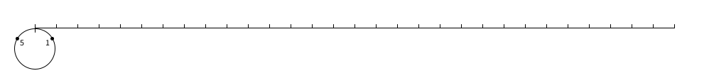

## Finding all primes up to half a billion in 83 ms

Author: [adamant](https://codeforces.com/profile/adamant) \
Source: [https://codeforces.com/blog/entry/149218](https://codeforces.com/blog/entry/149218) \
Tags: `simd`, `sieve`, `constant factor`, `vectorization`
 

Hi everyone!

I was itching to apply SIMD in another problem, and this time my attention picked the following problem:

[Library Checker — Enumerate Primes](https://judge.yosupo.jp/problem/enumerate_primes). You are given $N$, $A$ and $B$. Find $\pi ( N )$, and print all $p_{kA+B} \le N$.

It is guaranteed that $N \le 5 \cdot 10^8$ and that the total number of primes to print is at most $10^6$.

---

After some tweaking, I managed ([#336744](https://judge.yosupo.jp/submission/336744)) to reduce my time consumption in this problem to **83 ms** and memory consumption to **25 MiB**, which makes it a top-1 submission on the Library Checker. For comparison, the top-2 solution ([#148169](https://judge.yosupo.jp/submission/148169)) takes 172 ms and 15 MiB, meaning that what I describe here is a 2x improvement in terms of the running time.

We can also compare it to what appears to be the state of the art of sieving, the [primesieve](https://github.com/kimwalisch/primesieve) tool. On my laptop, it runs for $27$ ms on one thread with $n=5 \cdot 10^8$, while my program runs for $67$ ms, of which $9.5$ ms is typically the output. Ignoring the latter part, we can say that it is within 2x from the state of the art at this scale.

### Sieving recap

In its core, my solution basically implements the standard $O(n \log \log n)$ sieve, with two separate optimizations for small and large primes. In the standard sieve, we go over all prime numbers $p_0,p_1,p_2, \dots$ in order, and mark all non-trivial multiples of the current prime number as composite.

In this setup, we can see that the contribution to the total runtime per prime is very non-uniform. We have first, say, $200$ primes, for which individual contribution is significant, as each prime requires us to visit a lot of densely populated numbers, and then we have all the others, where each individual number requires reasonably small amount of operations on sparsely distributed numbers, but they add up due to their quantity.

These two parts of sieving require distinct techniques to improve them, but both eventually boil down to the concept of *wheels*.

### Wheeling factorization

Let's fix two prime numbers $p$ and $q$. Individually, the first requires us to go in steps of $p$ and the second in steps of $q$. But after $q$ steps of the first prime and $p$ steps of the second prime, they will end up in the point $p q$, from which on their patterns will repeat. Thus, we can combine combine their individual patterns into a new joint pattern of length $p q$.



We use the term **wheel** when reasoning about such patterns, as we can imagine applying such pattern as "rolling" the wheel, on which we marked numbers (non-)coprime with $p q$, and only working with numbers that get touched by the marks on the wheel. Similarly to the case of two primes, we can generally reason about a wheel defined by $p_1, \dots , p_k$.

Let's see how idea of wheels applies to the dense and sparse parts of the sieve.

### Dense sieving

Assume that $p q$ is very small. Then, we can do regular sieving on numbers $0, 1, \dots, pq−1$, and record for each number whether it is coprime with $p q$ or not. Then, we can "roll" the wheel and mark all numbers that are not co-prime with $p q$ as composite. If we do it naively, this will take $n$ operations, which seems much worse than doing $\lfloor \frac{n}{p} \rfloor + \lfloor \frac{n}{q} \rfloor$.

The key idea for the speedup here is, of course, to put the pattern, and the whole sieve too, in a bitset. Thus, we will create a bit mask denoting the pattern, and then we can apply it to the sieve by doing bitwise $\text{AND}$, which will process $64$ numbers at a time. We should be careful, however, to make sure that, when we reach the end of the pattern, we can start applying it further right away, which we can only do if the length of the pattern is a multiple of $64$.

In other words, we can take any group of primes $p_1, \dots , p_k$, join them in a single pattern and process all at once in $\lfloor \frac{n}{64} \rfloor$ bit operations, after spending $64 \cdot p_1 \dots p_k$ operations to actually build up the pattern of appropriate length. For small primes and large $n$, it is an improvement to do so over sieving individual numbers in $\lfloor \frac{n}{p_1} \rfloor + \dots + \lfloor \frac{n}{p_k} \rfloor$.


### Vectorization


<details>

<summary> Vectorization recap </summary>

Vectorization is the usage of wide SIMD (Single Instruction Multiple Data) registers that allow to execute several arithmetic commands at once on adjacent blocks of numbers, similar to how bitsets work.

Any code that uses vectorization requires you to set optimization level to `-O3` or enable `-ftree-vectorize`. It is also recommended to set `avx2` target, unless the online judge uses `-march=native` compilation flag.

You can do this as follows:
```cpp
#pragma GCC optimize("O3")
#pragma GCC target("avx2")

// or via function attributes
[[gnu::optimize("O3"), gnu::target("avx2")]]
void func1() {
    ...
}
// or via old attribute syntax (only old syntax works on lambdas)
__attribute__((optimize("O3"), target("avx2")))
void func2() {
    ...
}
```

Attributes *only* apply to the function you attached them to, and not to its other function calls, unless they are inlined. You may need to reapply target attribute to lambdas if you don't set global pragma. You can also drop `avx2`, in which case the program will use $128$-bit registers instead of $256$-bit, which are slower. [Beware of using Ofast](https://codeforces.com/blog/entry/149099).

</details>

We may now notice that the operations we do are notoriously simple and sequential, something that goes perfectly with vectorization. We, however, still should write them in a way that would hint the compiler that it should vectorize the code.

Consider this implementation:
```cpp
void apply(vector<uint64_t> &sieve, vector<uint64_t> &pattern) {
    size_t N = size(sieve), M = size(pattern);
    size_t j = 0;
    for(size_t i = 0; i < N; i++) {
        sieve[i] &= pattern[j++];
        j = j == M ? 0 : j;
    }
}
```

it looks simple, but if we look at the [assembly](https://godbolt.org/z/3fo6fYfoP), it is **not** vectorized, because of how unpredictably the variable $j$ behaves. A more or less standard way to make sure compiler *will* vectorize the loop is to write it as follows:
```cpp
void apply(vector<uint64_t> &sieve, vector<uint64_t> &pattern) {
    size_t N = size(sieve), M = size(pattern);
    size_t i = 0;
    for(; i + M <= N; i += M) {
        for(size_t j = 0; j < min(M, N - M); j++) {
            sieve[i + j] &= pattern[j];
        }
    }
}
```

Looking at the [assembly](https://godbolt.org/z/vnxWTd5vE), we indeed see that the hot part of the loop now looks like this:

<details>

<summary> Assembly </summary>

```
vmovdqu  ymm14, YMMWORD PTR [rax+r9]
vpand    ymm15, ymm14 , YMMWORD PTR [rdx+r9]
vmovdqu  ymm0 , YMMWORD PTR [rax+ 32+r9]
vmovdqu  ymm2 , YMMWORD PTR [rax+ 64+r9]
vmovdqu  YMMWORD PTR [rax+r9], ymm15
vpand    ymm1 , ymm0 , YMMWORD PTR [rdx+ 32+r9]
vmovdqu  ymm4 , YMMWORD PTR [rax+ 96+r9]
vmovdqu  ymm6 , YMMWORD PTR [rax+128+r9]
vmovdqu  ymm8 , YMMWORD PTR [rax+160+r9]
vmovdqu  YMMWORD PTR [rax+ 32+r9], ymm1
vpand    ymm3 , ymm2 , YMMWORD PTR [rdx+ 64+r9]
vmovdqu  ymm10, YMMWORD PTR [rax+192+r9]
vmovdqu  ymm12, YMMWORD PTR [rax+224+r9]
vmovdqu  YMMWORD PTR [rax+ 64+r9], ymm3
vpand    ymm5 , ymm4 , YMMWORD PTR [rdx+ 96+r9]
vmovdqu  YMMWORD PTR [rax+ 96+r9], ymm5
vpand    ymm7 , ymm6 , YMMWORD PTR [rdx+128+r9]
vmovdqu  YMMWORD PTR [rax+128+r9], ymm7
vpand    ymm9 , ymm8 , YMMWORD PTR [rdx+160+r9]
vmovdqu  YMMWORD PTR [rax+160+r9], ymm9
vpand    ymm11, ymm10, YMMWORD PTR [rdx+192+r9]
vmovdqu  YMMWORD PTR [rax+192+r9], ymm11
vpand    ymm13, ymm12, YMMWORD PTR [rdx+224+r9]
vmovdqu  YMMWORD PTR [rax+224+r9], ymm13
```

</details>

Using `ymm` registers is a clear sign that AVX2 is involved. Doing it this way, allows us to apply the pattern to the whole sequence in $\lfloor \frac{n}{256} \rfloor$, rather than $\lfloor \frac{n}{64} \rfloor$, which also shifts the threshold of numbers for which it is better to do this than sparse sieving further to the right.


### Alignment

*Thanks a lot to [Dragos](https://codeforces.com/profile/Dragos) for feeding my code to ChatGPT and transmitting its suggestions to me! The suggestions were mostly useless, but they prompted me to think more on what can be done to improve this part, which ended up in this section.*

There is yet another important optimization that we can apply to make the vectorized code even faster. Consider this:
```cpp
void apply(vector<uint64_t> &sieve, vector<uint64_t> &pattern) {
    size_t N = size(sieve), M = size(pattern);
    size_t i = 0;
    for(; i + M <= N; i += M) {
        auto s_ptr = assume_aligned<32>(&sieve[i]);
        auto p_ptr = assume_aligned<32>(&pattern[0]);
        for(size_t j = 0; j < min(M, N - M); j++) {
            s_ptr[j] &= p_ptr[j];
        }
    }
}
```

If we look again at the [assembly](https://godbolt.org/z/6n5vd8YP1), we will see that the hot part is now as follows:

<details>

<summary> Assembly </summary>

```
vmovdqa ymm14, YMMWORD PTR [rdx+rsi]
vpand   ymm15, ymm14 , YMMWORD PTR [rcx+rsi]
vmovdqa ymm0 , YMMWORD PTR [rsi+ 32+rdx]
vmovdqa ymm2 , YMMWORD PTR [rsi+ 64+rdx]
vmovdqa YMMWORD PTR [rdx+rsi], ymm15
vpand   ymm1 , ymm0 , YMMWORD PTR [rcx+ 32+rsi]
vmovdqa ymm4 , YMMWORD PTR [rsi+ 96+rdx]
vmovdqa ymm6 , YMMWORD PTR [rsi+128+rdx]
vmovdqa ymm8 , YMMWORD PTR [rsi+160+rdx]
vmovdqa ymm10, YMMWORD PTR [rsi+192+rdx]
vmovdqa YMMWORD PTR [rsi+32+rdx], ymm1
vpand   ymm3 , ymm2 , YMMWORD PTR [rcx+ 64+rsi]
vmovdqa ymm12, YMMWORD PTR [rsi+224+rdx]
vmovdqa YMMWORD PTR [rsi+ 64+rdx], ymm3
vpand   ymm5 , ymm4 , YMMWORD PTR [rcx+ 96+rsi]
vmovdqa YMMWORD PTR [rsi+ 96+rdx], ymm5
vpand   ymm7 , ymm6 , YMMWORD PTR [rcx+128+rsi]
vmovdqa YMMWORD PTR [rsi+128+rdx], ymm7
vpand   ymm9 , ymm8 , YMMWORD PTR [rcx+160+rsi]
vmovdqa YMMWORD PTR [rsi+160+rdx], ymm9
vpand   ymm11, ymm10, YMMWORD PTR [rcx+192+rsi]
vmovdqa YMMWORD PTR [rsi+192+rdx], ymm11
vpand   ymm13, ymm12, YMMWORD PTR [rcx+224+rsi]
add     rsi, 256
vmovdqa YMMWORD PTR [rsi-32+rdx], ymm13
```

</details>

It looks almost the same, except that compiler uses `vmovdqa` (aligned load) instead of `vmovdqu` (unaligned load) now, giving a further bit of performance boost to the code.

**Important**: To make use of this property, you **must** ensure that the memory actually *is* aligned to $32$ bytes. You will need `pattern.size()` to be a multiple of $256$, rather than $64$, to make sure `sieve[i]` is aligned for any $i$. Additionally, the whole structure should be aligned, so that it works for `sieve[0]`.

For arrays, you can achieve this with `alignas(32)`. For vectors, you must use an aligned allocator, or get aligned memory manually. I use the following allocator (see [big_alloc.hpp](https://lib.cp-algorithms.com/cp-algo/util/big_alloc.hpp) from CP-Algorithms Library for full version):

<details>

<summary> big_alloc.hpp </summary>

```cpp
template <typename T, size_t Align = 32>
class big_alloc {
public:
    using value_type = T;
    template <class U> struct rebind { using other = big_alloc<U, Align>; };
    constexpr bool operator==(const big_alloc&) const = default;
    constexpr bool operator!=(const big_alloc&) const = default;

    big_alloc() noexcept = default;
    template <typename U, std::size_t A>
    big_alloc(const big_alloc<U, A>&) noexcept {}

    [[nodiscard]] T* allocate(std::size_t n) {
        std::size_t align = std::max<std::size_t>(alignof(T),  Align);
        return static_cast<T*>(::operator new(n * sizeof(T), std::align_val_t(align)));
    }

    void deallocate(T* p, std::size_t n) noexcept {
        if (!p) return;
        std::size_t align  = std::max<std::size_t>(alignof(T),  Align);
        ::operator delete(p, n * sizeof(T), std::align_val_t(align));
    }
};
```

</details>


### Storage size reduction

Before going into the next part, let's take a moment to think about memory consumption. From the dense part, we already settled on using a bitset as our storage of the information on whether a particular number is prime. If we use one bit for all numbers from $1$ to $N$, we will end up using around $70$ MiB of memory in this problem.

This is problematic, because larger storage means that we need to traverse a larger bitset on dense sieving, and it also means that we're more likely to encounter cache misses. Besides that, it's likely that we may need precious memory for something else in the problem.

To mitigate this, we can start by dropping *all even numbers*. In other words, we would only store bits for odd numbers, and for even numbers it's meaningless, as we already know that they are composite.

This will drop memory consumption to $40$ MiB, which is much better, and improve runtime slightly as well, as we now need to go over fewer numbers. This idea then maybe generalized to using a wheel of small primes, and removing from the bitset all numbers that are not co-prime with those primes.

When doing this we, unfortunately, get into the territory of diminishing returns very quickly, as each prime number we add reduces the storage by a factor of $\frac{p−1}{p}$, which becomes increasingly negligent as we add more primes. At the same time, this significantly complicates the whole setup, because when we work with more than $1$ prime in the wheel, numbers that are co-prime with them become more irregular, and their period increases super-exponentially.

As of now, for numbers up to $10^9$ the sweet spot appears to be in the $210$-wheel, composed of prime numbers ${2,3,5,7}$. It has $48$ numbers co-prime to the period of the wheel, meaning that we get a reduction of $\frac{210}{48} = 4.375$ for the storage.

Here are some utilities that I find useful when compressing storage using this wheel:

<details>

<summary> C++ </summary>

```cpp
constexpr auto wheel_primes = std::array{2u, 3u, 5u, 7u};
constexpr uint8_t period  = std::ranges::fold_left(wheel_primes, 1u, std::multiplies{});
constexpr uint8_t coprime = std::ranges::fold_left(wheel_primes, 1u, [](auto a, auto b){ return a * (b - 1); });
constexpr auto coprime_wheel = [](auto x) {
    return std::ranges::all_of(wheel_primes, [x](auto p){ return x % p; });
};

// Residues coprime to period
constexpr auto res_wheel = []() {
    std::array<uint8_t, coprime> res;
    int idx = 0;
    for(uint8_t i = 1; i < period; i += 2) {
        if (coprime_wheel(i)) {
            res[idx++] = i;
        }
    }
    return res;
}();

// Maps residue mod period to pre-upper_bound index in res_wheel
constexpr auto state_wheel = []() {
    std::array<uint8_t, period> state;
    uint8_t idx = 0;
    for(uint8_t i = 0; i < period; i++) {
        state[i] = idx;
        idx += coprime_wheel(i);
    }
    return state;
}();

// Add to reach next coprime residue
constexpr auto add_wheel = []() {
    std::array<uint8_t, period> add;
    for(uint8_t i = 0; i < period; i++) {
        add[i] = 1;
        while (!coprime_wheel(i + add[i])) {
            add[i]++;
        }
    }
    return add;
}();

constexpr auto gap_wheel = []() {
    std::array<uint8_t, coprime> gap;
    for(uint8_t i = 0; i < coprime; i++) {
        gap[i] = add_wheel[res_wheel[i]];
    }
    return gap;
}();
```

</details>


They are pretty generic, as I wanted to also experiment with other possible wheel compositions (which all turned out to be significantly worse). With the utilities above, it is possible to implement these two functions, used to convert between (un)compressed indices:
```cpp
// Convert value to ordinal (index in compressed bit array)
constexpr uint32_t to_ord(uint32_t x) {
    return (x / period) * coprime + state_wheel[x % period];
}

// Convert ordinal to value
constexpr uint32_t to_val(uint32_t x) {
    return (x / coprime) * period + res_wheel[x % coprime];
}
```

Using compressed storage also requires some changes to the dense sieving, but luckily they are pretty minor and somewhat natural, and mostly related to how we build wheels (for example, we now need that the period is a multiple not only of $256$, but also of $210$). You may find some details in the source code of my submission.


### Sparse sieving

My initial implementation was only concerned with the dense sieving part, as I hoped that if we start with large enough $p$, the sum of reciprocals of remaining $p_k$ will be negligibly small. Unfortunately, it is not the case, and the sparse sieving still takes up roughly *thrice* more time for me than the dense sieving.

Naturally, running a segmented sieve is good for this purposes, but one should be careful of the segment size. Too small segment will cause a lot of overhead in iterating over primes in each segment, while too large segment will lead to a lot of cache misses, overall slowing the program down.

Now, when it comes to optimizing this part, obviously we can't use masks or group them together, like in SIMD part, as the multiples are just too sparse. So, optimizations for this part usually focus on reducing how many multiples we need to consider.

As the simplest example, when we consider $k p$, it doesn't make sense to consider even values of $k$, as we already know that they are multiples of $2$, so we can skip half of them by going over $3p, 5p$ and so on.

This idea extends somewhat naturally into using wheels. There are some different options to consider here, for example one might even try to only use multiples that were not filtered out by the dense part. Unfortunately, they behave quite irregularly, which would mean that we will need to do an expensive `to_ord` call every time we consider a particular multiple.

What appeared to contribute most to performance for me was, again, using $210$-wheel to sieve the multiples of each prime number. Core observation here is that for each prime, compressed indices of its multiples are periodic, in the sense that after $48$ steps, the index of the next multiple will be larger than the one we started at by $48p$.

Therefore, for each individual prime, we can pre-compute the full period of differences between adjacent multiples, and then use these values to actually perform the sieving. The main benefit of doing it this way is that we can stay in compressed coordinates most of the time, rather than constantly calling `to_ord(k * p)`.

There are also some technical details on how to make it slightly faster, for example, to avoid adjusting the index on each iteration, we can pre-compute double periods, and then, while $l+48p le r$, we can apply the full period of $48$ additions, and reduce the current state index by $48$. *Thanks a lot to [Qwerty1232](https://codeforces.com/profile/Qwerty1232) for suggesting this to me!*

