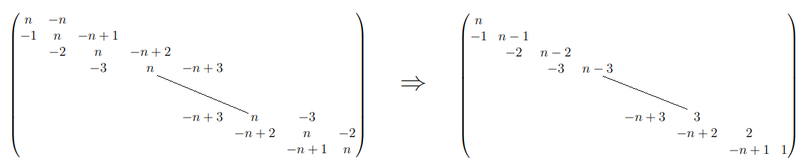
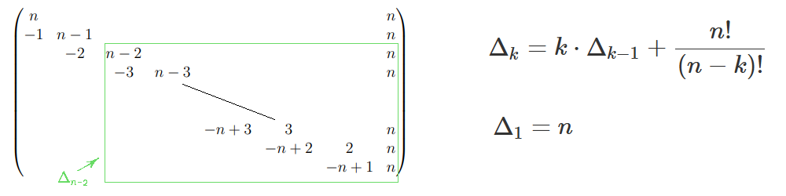
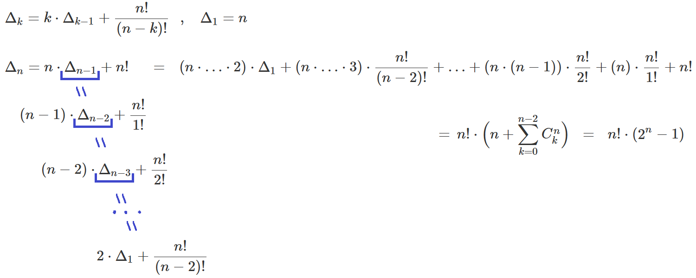
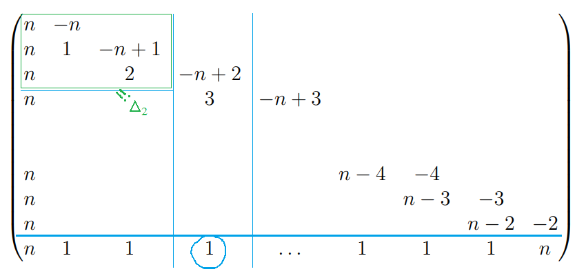

( [Задача 11. Ловушка Лорда](https://coderun.yandex.ru/selections/2025-winter-common/problems/lords-trap) из CodeRun Winter Challenge )

Дан $n$-мерный гиперкуб — граф, чьи вершины это все двоичные строки длины $n$ (множество $\set{0,1}^n$). Две вершины соединены ребром, если строки отличаются ровно в одном бите.

Вы стартуете в вершине $1^n$ (все биты равны $1$). На каждом шаге Вы выбирае равновероятно ребро из данной вершины и переходите по нему. \
Требуется найти математическое ожидание числа шагов до первого попадания в вершину $0^n$.

Вообще это частный случай задачи [D. Гибкая строка возвращается](https://codeforces.com/contest/1778/problem/D) с codeforces.

 Решение 
 

Мы хотим из строки $11 \dots 1$ получить строку $00 \dots 0$ инвертируя на каждом шаге случайный бит.

Отметим: нам важно только количество единичек, а не  их полжения! \
$\Rightarrow T_k$ - математическое ожидание числа шагов до первого попадания в строку $00 \dots 0$ при старте из строки с $k$ единичками

При выполнение шага из состояния с $i$ единичками, мы попадаем либо в состояние с $i-1$ единичками, либо в состояние с $i+1$ единичками: \
$T_i = P[i \rightarrow i-1] \cdot (1 + T_{i-1}) +  P[i \rightarrow i+1] \cdot (1 + T_{i+1})$ \
$T_0 = 0$.

Вероятность что количество единичек уменьшится, равна вероятности что случайно выбранный бит это $1$: \
$P[i \rightarrow i-1] = i/n$

Итого есть трёхдиагональная система уравнений: \
$-(n-i) \cdot T_{i+1} + n\cdot T_i - i \cdot T_{i-1} = n$

Её можно решить методом прогонки. Однако в задаче просят арифметику по модулю, и сразу и не скажешь на какие значения придется делить в методе прогонки, потому скорее всего придется искать обратный на каждом шаге прогонки за $\ln(MOD)$.

---

Давай-те попробуем метод Крамера. (Вообще я пытался найти сразу $T_n$, но там чет неудача с реккурентой. Однако в задаче с codeforces говорилось что можно найти $T_1 = 2^n - 1$.)

 Считаем детерминанты 

Найдем детерминант "всей" матрицы (линия - обозначает главную диагональ).

Мы можем прибавить 1-ый столбец ко 2-му, затем обновлённый 2-ой столбец к 3-му, и т.д. В итоге третья диагональ полностью сократиться $\Rightarrow$ детерминант исходной матрицы равен $n!$

Теперь в исходной матрице заменим последний столбец на столбец из $n$. Проделав те же преобразования получим матрицу:

(! Если что под $\Delta_i$ обозначается детерминант для урезанной матрицы, а не как принято в методе Крамера детерминант для исходной матрицы с замененным $i$-ым столбцом) 

Будем расскладывать детерминант по первому столбцу и заметим закономерность: (например можно рассмотреть $\Delta_{n-2}$ (выдлен на рисунке) и проверить коэфициенты) \
$\Delta_k = k \cdot \Delta_{k-1} + (n+1 - k) \cdot (n+1 - k + 1) \cdot \ldots \cdot n$ 

Распишем реккуренту:

Итого: $T_1 = \frac{n! (2^n - 1)}{n!} = 2^n - 1$

---

[свернуть] (ахх, жаль так не работает..)

$ \text{ } $

Итого: $T_1 = \frac{n! (2^n - 1)}{n!} = 2^n - 1$

Теперь зная $T_0$ и $T_1$ можем взогнать по: $T_{i+1} = \frac{n\cdot(T_i -1) - i\cdot T_{i-1}}{n-i}$. \
И тут мы точно делим только на числа из отрезка $[1, n]$ обратные к которым можно найти за $O(n)$ предподсчёта (например [emaxx](http://www.e-maxx-ru.1gb.ru/algo/reverse_element)).

---

$ \text{ } $
 

Давайте для упокоения выпишем реккуренту и для $T_n$.

 Очередной заспамленный вывод 

Первый шаг схожий: прибавим последний столбец к предпоследнему, затем обновлённый предпоследний столбец к пред-предпоследнему, и т.д. В итоге: 

Обозначим за $\Delta_i$ детерминант усеченной матрицы. \
Раскладываем детерминант полной матрицы $\Delta$ по нижней строке и получаем (просто забудем про минусы и как же хорошо что все знаки сошлись): \
$\Delta = n \cdot n! + 1 \cdot \Delta_0 \cdot (n-1)! + 1 \cdot \Delta_1 \cdot (n-2)! + \dots + 1 \cdot \Delta_{n-3} \cdot 3! + n \cdot \Delta_{n-2} = $ \
$ = n \cdot n! + \sum\limits_{k=0}^{n-3} \Delta_k \cdot (n-1-k)! + n \cdot \Delta_{n-2}$

Детерминант $\Delta_k$ разложем по нижней строчке и получим реккурентное соотношение: \
$\Delta_k = k \cdot \Delta_{k-1} + n \cdot n (n-1) \dots (n+1 - k)$ \
$\Delta_0 = n$

Видно что из всех $\Delta_k$ можно вынести $n$. Также давайте сразу поделим на детерминант первоначальной матрицы $n!$ (т.к. по методу Крамера: $T_n = \Delta / n!$).

Поэтому в сумме будут слагаемые: $ A_k := \frac{\Delta_k \cdot (n-1-k)!}{n \cdot n!} $. Давай-те подставим реккурентную формулу для $\Delta_k$: \
$A_k = (k \cdot \frac{\Delta_{k-1}}{n} +  n (n-1) \dots (n+1 - k)) \cdot \frac{(n-1-k)!}{n!} = k \cdot \frac{\Delta_{k-1} \cdot (n-1-k)!}{n \cdot n!} + \frac{1}{n-k}$

Итого: $A_k = \frac{k}{n-k} \cdot A_{k-1} + \frac{1}{n-k}$ , $A_0 = \frac{1}{n}$

Итоговая формула:  $T_n = n \cdot ( 1 + \sum\limits_{k=0}^{n-3} A_k + n \cdot A_{n-2} )$

---
[свернуть]

$\text{}$

$T_n = n \cdot ( 1 + \sum\limits_{k=0}^{n-3} A_k + n \cdot A_{n-2} )$ \
где: $A_k = \frac{k}{n-k} \cdot A_{k-1} + \frac{1}{n-k}$ , $A_0 = \frac{1}{n}$

Вообще полученые $A$-шки выглядят так: \
$A_0 = \frac{1}{n}$ \
$A_1 = \frac{1}{n-1} + \frac{1}{n-1}  \frac{1}{n}$ \
$A_2 = \frac{1}{n-2} + \frac{2}{n-2}  \frac{1}{n-1} + \frac{2}{n-2}  \frac{1}{n-1} \frac{1}{n}$ \
$A_3 = \frac{1}{n-3} + \frac{3}{n-3} \frac{1}{n-2} + \frac{3}{n-3} \frac{2}{n-2}  \frac{1}{n-1} + \frac{3}{n-3} \frac{2}{n-2}  \frac{1}{n-1} \frac{1}{n}$ \
$A_4 = \frac{1}{n-4} + \frac{4}{n-4} \frac{1}{n-3} + \frac{4}{n-4} \frac{3}{n-3} \frac{1}{n-2} + \frac{4}{n-4} \frac{3}{n-3} \frac{2}{n-2}  \frac{1}{n-1} + \frac{4}{n-4} \frac{3}{n-3} \frac{2}{n-2}  \frac{1}{n-1} \frac{1}{n}$

 
Можно попробовать как в телескопических рядах разъединить: $\frac{1}{a} \cdot \frac{1}{a+k} = \frac{1}{k} (\frac{1}{a} - \frac{1}{a+k})$.

Лол, окакзывается можно даже и такое доказать (по индукции): $\frac{1}{a} \frac{1}{a+1} \frac{2}{a+2} \dots \frac{n}{a+n} = \sum\limits_{k=0}^n \binom{n}{k} \frac{(-1)^k}{a+k}$.

Но для $A$-шек нам понадобится только формула для $\frac{1}{a} \cdot \frac{1}{a+k}$ : будем итеративно смотреть какие коэфициенты стоят перед $\frac{1}{a+i}$ - сначала для  $A_1$, потом для $A_2 = \frac{1}{n-2} + \frac{2}{n-2} \cdot A_1$ и т.д. \
В итоге прийдем к такому: \
$A_k = \frac{2^k}{n-k} - \frac{2^{k-1}}{n-k+1} \cdot \frac{k}{1} + \frac{2^{k-2}}{n-k+2} \cdot \frac{k}{1}  \cdot \frac{k-1}{2} - \ldots = \sum\limits_{t=0}^k 2^{k-t} \binom{k}{t} \cdot \frac{(-1)^t}{n-k+t}$

Если мы хотим отдельно рассматривать каждую дробь $\frac{1}{n-a}$, то должны начинать с $A_a$ и брать $t = k-a$. Это даёт (каким-то образом это верно и для $n = 2$, ну а для больших $n$ с суммами всё нормально): \
$T_n = n \cdot (n \cdot 2^{n-3} + 1) + n \cdot \sum\limits_{a=0}^{n-3} ( [ n \cdot (-1)^{n-a} \binom{n-2}{a} +  \sum\limits_{k=a}^{n-3} (-1)^{k-a} \binom{k}{a} ] \times \frac{2^a}{n-a} )$ 

---

$\text{} $

В общем наумолял у deepseek-а, оказывается есть такое (впрочем очевидно что это какая-то известная задача):
* $T_k = \sum\limits_{i=1}^{k} \frac{1}{ \binom{n-1}{i-1} } \sum\limits_{j= i}^{n} \binom{n}{j}  $ (даже не хочется эту муть проверять)
* $T_n = 2^{n-1} \sum\limits_{i=0}^{n-1} \frac{1}{ \binom{n-1}{i} } $ (проверил для $n=4$)

<\details>
