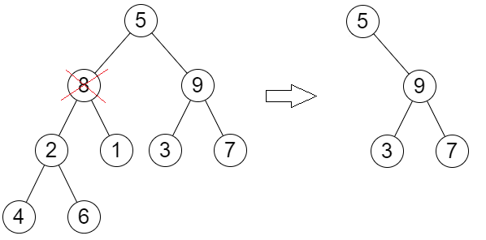

#### [3321. Find X-Sum of All K-Long Subarrays II](https://leetcode.com/problems/find-x-sum-of-all-k-long-subarrays-ii/description/)

Определим **L-sum** массива как:

* Подсчитайте количество вхождений каждого числа в массиве

* Оставьте только топ $L$ по частоте чисел (при равенстве выбирается большее число)

* Подсчитайте сумму оставшихся элементов массива

Дан массив $a[N]$ и число $k \le N \text{ } (\le 10^5)$. Требуется для каждого окна размера $k$ найти **L-sum**.

<details>

<summary> Решение  </summary>

Создадим два множества: в одном будем хранить элементы вошедшие в топ $L$, в другом невошедшие.

При добавлении элемента $x$ он может вытеснить кого-то из топа если: `{cnt_x, x} > top.smaller_pair` и соответственно `smaller_pair` уйдет в нижнее множество.

При удалении элемента $x$ (уменьшении его количества на один)  он может освободить место в топе если: `{cnt_x, x} < bottom.larger_pair` и соответственно `larger_pair`  перейдёт в топ.

При этом поддерживаем текущую сумму элементов в топ $L$ просто через арифметические операции ($+$,$-$) с переменной `active_sum`.

В итоге в одном действии мы перекладываем максимум два элемента. Итоговая сложность: $O( N \ln(k) )$.

```cpp
int L;
long long active_sum = 0;

map< int, int > exist;          // < value :  freq >
set< pair<int, int> > in, out;  // < freq  , value >

void swap_upd(pair<int, int> p_in, pair<int, int> p_out) {
    active_sum -= 1LL* p_in .first * p_in .second;
    active_sum += 1LL* p_out.first * p_out.second;
}
    
void add_elem(int e) {  // добавлнение элемента
    int  cnt  = exist[e]++;
    auto curr = pair{cnt  , e};
    auto updd = pair{cnt+1, e};

    if ( cnt != 0 )
        (in.count(curr) ? in : out).erase(curr);
    
    pair<int, int> last; 
    if( in .size() == L && (last = *in.begin()) < updd ) {
        in .erase (last);
        out.insert(last);
        swap_upd(last, curr);
    }

    bool to_top = ( in.size() < L );
    if ( to_top ) active_sum += e;
    (to_top ? in : out).insert(updd);
}

void del_elem(int e) {  // удаление элемента
    int  cnt  = exist[e]--;
    auto curr = pair{cnt  , e};
    auto updd = pair{cnt-1, e};

    (in.count(curr) ? in : out).erase(curr);
    
    pair<int, int> dawn; 
    if( !out.empty() && (in.size() < L) && (dawn = *out.rbegin()) > updd ) {
        out.erase (dawn);
        in .insert(dawn);
        swap_upd(curr, dawn);
    }

    bool to_top = ( in.size() < L );
    if ( to_top ) active_sum -= e;

    if( cnt > 1 )
        (to_top ? in : out).insert(updd);
}

    
vector<long long> findXSum(vector<int>& a, int k, int LL) {
    L = LL;

    vector<long long> ans;
    for(int i = 0; i < k; i++) add_elem(a[i]);

    ans.push_back( active_sum );

    for(int i = k; i < a.size(); i++) {
        add_elem(a[i]);
        del_elem(a[i-k]);
        ans.push_back( active_sum );
    }

    return ans;
}
```

</details>

---

$\text{ }$


#### [2458. Height of Binary Tree After Subtree Removal Queries](https://leetcode.com/problems/height-of-binary-tree-after-subtree-removal-queries/description/) 
(нашёл эту задачу из [этого решения](https://leetcode.com/problems/longest-common-prefix-of-k-strings-after-removal/solutions/6539692/precomputations-by-fahad_mubeen-umch/) задачи 3485)

Дано корневое дерево.\
Требуется определить какой станет высота дерева после удаления $i$-ой вершины вместе со всем её поддеревом (удаления выполняются независимо).



<details>

<summary> Решение  </summary>

Сперва подсчитаем высоту каждого поддерева.

Теперь выполняем `dfs` поддерживая для текущей вершины (`curr`) высоту дерева если бы мы не переходили в вершину `curr`. В коде наверное понятней...

```cpp
int sz [100001];
int ans[100001];

int sz_dfs(TreeNode* r) {
    if( !r ) return 0;
    return sz[r->val] = max(sz_dfs(r->left), sz_dfs(r->right)) + 1;
}

void ans_dfs(TreeNode* r, int d = 0, int mx = 0) {
    if( !r ) return;

    ans[r->val] = mx;

    int sz_l = (r->left  ? sz[r->left ->val] : 0);
    int sz_r = (r->right ? sz[r->right->val] : 0);
    ans_dfs( r->left , d+1, max(mx, d+sz_r) );
    ans_dfs( r->right, d+1, max(mx, d+sz_l) );
}

vector<int> treeQueries(TreeNode* root, vector<int>& queries) {
    sz_dfs (root);
    ans_dfs(root);

    vector<int> qans;
    for(auto i : queries)
        qans.push_back( ans[i] );
    return qans;
}
```

</details>

---

$\text{ }$


#### АДСКИ СЛОЖНАЯ РЕАЛИЗАЦИЯ

Дан массив вида: $[a_1, \dots, a_n, b_1, \dots, b_n]$. \
Надо переставить элементы чтобы получить: $[a_1, b_1, a_2, b_2, \dots, a_n, b_n]$.


<details>

<summary> O(N ln N) time, O(ln N) space </summary>

Идейно разделяй и влавствуй: хотим "перемешать" отрезки $[l, r)$ и $[r, t)$ - для этого мы правую половину первого отрезка swap-аем с левой половиной второго отрезка. И затем вызываемся реккурсивно от половин.

Убил на этот "merge" целый день..

```cpp
class Solution {
public:
    // [l, r) [r, t)
    void recurse(vector<int>& a, int l, int r, int t) {
        if( l >= r || r >= t ) return;

        int l1 = r-l, l2 = t-r;
        
        if( l1 > l2 ) l++;
        if( l1 < l2 ) t--;

        int lcp = (t-r + 1)/2;
        for(int i = 0; i < lcp; i++) {
            swap( a[r-lcp + i], a[r+i] );
        }

        recurse(a, l, r-lcp, r);
        recurse(a, r, r+lcp, t);
    }

    vector<int> shuffle(vector<int>& a, int n) {
        recurse(a, 0, n, 2*n);

        // наподгонял, но в конце получается массив вида:
        //     [b1, a1, b2, a2, ...]
        // поэтому ещё надо сделать этот цикл
        for(int i = 0; i < 2*n; i += 2) {
            swap( a[i], a[i+1] );
        }
        return a;
    }
};
```

</details>


<details>

<summary> O(N) time, O(1) space ?? </summary>

Есть такое решение: [by Jump32Catch](https://leetcode.com/problems/shuffle-the-array/solutions/7190503/linear-in-place-shuffle-using-huang-lang-eg8q/), но я пока не разбирался.... <- TODO

В общем там отсылается к: Huang–Langston: [Practical In-Place Merging (1988)](https://dl.acm.org/doi/pdf/10.1145/42392.42403)

</details>


---

$\text{ }$


#### [1526. Minimum Number of Increments on Subarrays to Form a Target Array](https://leetcode.com/problems/minimum-number-of-increments-on-subarrays-to-form-a-target-array/description)

Требуется нулевой массив превратить в заданный массив `target` за минимальное число операций. \
Одна операция это прибавить $+1$ на отрезке.

<details>

<summary> Решение </summary>


После этого рисунка очевидно что:
```cpp
int ans = 0, prev = 0;
for(auto e : target) {
    ans += max( 0, e - prev );
    prev = e;
}
```

</details>


---

$\text{ }$

#### [Good Pairs](https://www.codechef.com/START38B/problems/GOODPAIRS)

Дано два массива $A$ и $B$ одинакового размера $N$. \
Найти количество пар $(i, j)$, $i < j$ таких что одновременно: $A[i] = B[j]$ и $A[j] = B[i]$.

<details>

<summary> Код решения</summary>

Первая идея (прям по вайбу MapReduce про который я недавно прочитал):
```cpp
void solve(int n, const vector<int>& A, const vector<int>& B) {
    map<int, map<int, int>> wa, wb;
    
    for(int i = 0; i < n; i++) {
        wa[a[i]][b[i]]++;
        wb[b[i]][a[i]]++;
    }
    
    ll ans = 0;
    for(const auto& [alpha, va] : wa) {
        if( !wb.count(alpha) ) continue;
        const auto& vb = wb[alpha];
        
        for(auto [betta, n1] : va) {
            if( !vb.count(betta) ) continue;
            int n2 = vb.at(betta);
        
            ans += alpha == betta ? 1LL* n1*(n1-1) : 1LL* n1*n2;
        }
    }
    
    cout << ans/2 << "\n";
}
```

Доработанная первая идея:
```cpp
void solve(int n, const auto& A, const auto& B) {
    map<pair<int, int>, pair<int, int>> w;
    
    for(int i = 0; i < n; i++) {
        w[ {A[i], B[i]} ].first ++;
        w[ {B[i], A[i]} ].second++;
    }
    
    ll ans = 0;
    for(auto [ab, nn] : w) {
        auto [alpha, betta] = ab;
        auto [n1, n2] = nn;
        
        ans += alpha == betta ? 1LL* n1*(n1-1) : 1LL* n1*n2;
    }
    
    cout << ans/2 << "\n";
}
```

Посмотрел "разбор" - и там просто очень простая и понятная идея!:
```cpp
void solve(int n, const auto& A, const auto& B) {
    map<pair<int, int>, int> w;
  
    ll ans = 0;
    while( n-- ) {  // экономим на for-ах
        auto [a, b] = pair{ A[n], B[n] };
        ans += w[ {b, a} ];
        w[ {a, b} ]++;
    }
    
    cout << ans << "\n";
}
```

</details>


---

$\text{ }$

