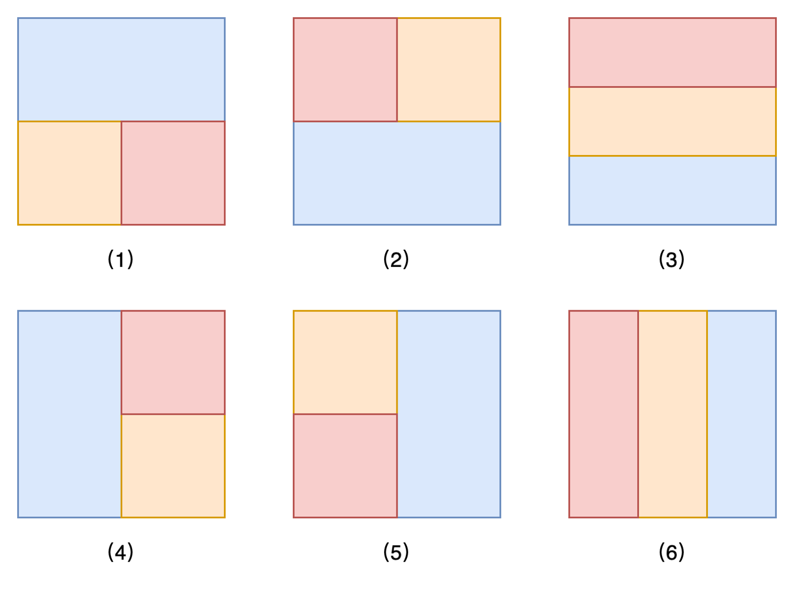
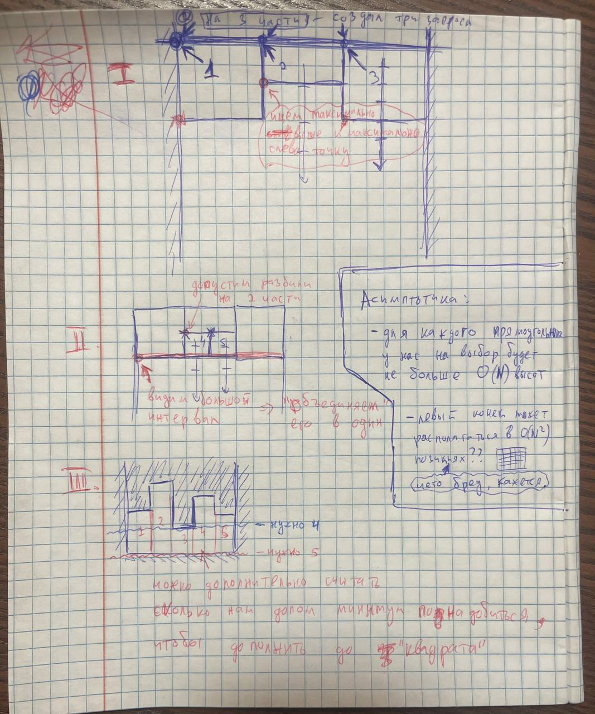
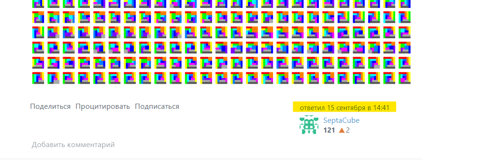

Inspired by: https://leetcode.com/problems/find-the-minimum-area-to-cover-all-ones-ii



Давайте обобщим: надо разбить прямоугольник на $N$ прямоугольников. Сколько различных вариантов есть? (с точностью до *топологии*: повороты/отражения)

<details>
	
<summary> Идейный алгоритм </summary>

По грубым оценкам реализуемый сейчас алгоритм будет работать $O(N^3)$ (- лол, чет оценка вообще бредовая, у нас выстоты для каждого прямоугольника *независимы*, *такчто будет что-то* $O(??^N)$ ).

</details>

Ещё интересно: мы можем каждую связаную область обозначать точкой и cоединять касающиеся области ребром - в итоге получится граф, интересно изучить его структуру. 


Хронологически:
* Написан прям очень неэфективный алгоритм `alt.cpp`, который переберает на сетке $N \times N$ прямоугольники и потом (тоже не эффективный) учет повтороней. \
В итоге получились следующие кол-ва разбиений: 

| #прямоугольников | 1 | 2 | 3 | 4 |  5 |   6 |   7 |    8 |
| ---------------- | - | - | - | - | -- | --- | --- | ---- |
| #разбиений       | 1 | 1 | 2 | 7 | 24 | 126 | 815 | 6465 |

Удивительно, но разогнаный (после майнкрафта) ноут расчитал последний столбец всего за $2$ минуты.

И конечно: https://oeis.org/A375129


* Давайте рассмотрим разбиения, в которых нет двух прямоугольников, образующих в объединении прямоугольник.

<details>
	
<summary> Пример </summary>

```
Нас интересует такое (появляется начиная с 5 прямоугольников):
    EDD
    ECB
    AAB

Такое не подходит, так как 'B' и 'D' в объединении дают прямоугольник
    EDC
    EBC
    AAC
```

</details>


<details>

<summary> ШОК </summary>

Обновили на днях: https://oeis.org/A340984 \
https://math.stackexchange.com/questions/4008337/how-many-prime-rectangle-tilings-are-there



</details>