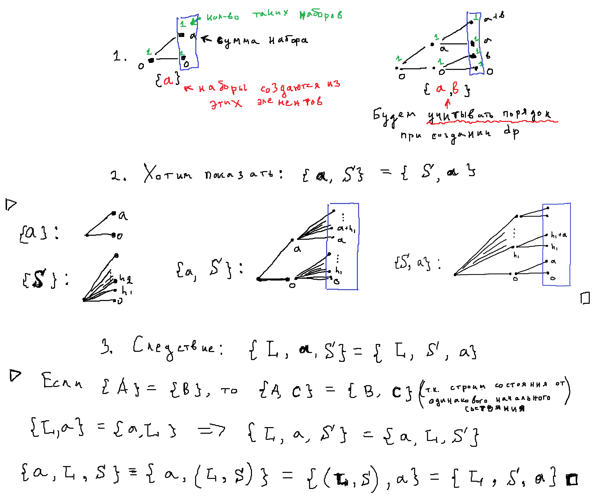
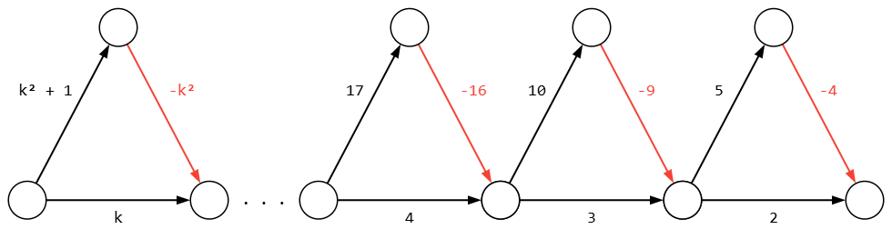
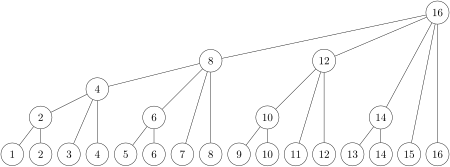
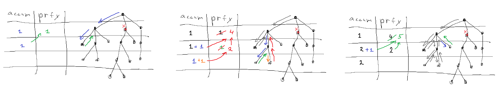

[**LeetCode 1358**](https://leetcode.com/problems/number-of-substrings-containing-all-three-characters/description/). \
Given a string `s` consisting only of characters $a$, $b$ and $c$. \
Return the number of substrings containing **at least** one occurrence of all these characters $a$, $b$ and $c$.

**Решение:** (не эффективно, зато красиво)  (нашёл [здесь](https://leetcode.com/problems/number-of-substrings-containing-all-three-characters/editorial/comments/2891380/))\
Пусть $A$ - подстроки, в которых содержится символ `'a'`. \
Аналогично множества $B$, $C$ - для символов `'b'`, `'c'`, соответственно.

Мы можем находить кол-во подстрок, состоящих **только** из определенных элементов `valid_elem` :
```c++
int f(set<char> valid_elem) {   // count of substrings with restriction
	int ans = 0;
	for(int l = 0; auto e : s)
		if( !valid_elem.count(e) ) l = 0;
		else ans += ++l;

	return ans;
}
```
Например:
1) подсроки состоящие только из элемента `"a"` - это на самом деле будет множество: $\text{}$ $(B \cup C)^\complement$ \
где: $X^\complement$ - дополнение множества $X$

2) подсроки состоящие только из элементов `"a"` или `"b"` - это будет: $\text{}$ $C^\complement$

$\Rightarrow$ $|A \cap B \cap C|$ $=$ $|\varnothing^\complement| - |A^\complement| - |B^\complement| - |C^\complement| + |(A \cup B)^\complement| + |(B \cup C)^\complement| + |(C \cup A)^\complement|$

Т.е.: ``` retrun f("abc") - f("bc") - f("ca") - f("ab") + f("c") + f("a") + f("b") ```

---

$\text{}$
$\text{}$

[**G. Студенческие советы**](https://codeforces.com/edu/course/2/lesson/6/2/practice/contest/283932/problem/G) \
Дано число $k$ - размер студенческого совета, и массив `a[1..n]` — количество студентов в $i$-й группе. \
Каждый студент состоит в какой-то (одной) группе, и студенты из одной группы не могут оказаться в одном совете. \
Также, каждый студент входит максимум в один совет.

Какое максимальное число советов может быть образовано?

**Решение:** бин-поиск по ответу \
Однако, как проверить возможность создания `cnt` советов?

Можно убедится, что следующий код позволяет это сделать:
```c++
bool can(ll cnt) {
    ll acc = 0;
    for(auto e : a)
        acc += min(cnt, (ll)e);
    return acc >= k*cnt;
}
```

---

$\text{}$
$\text{}$


[**146. LRU Cache**](https://leetcode.com/problems/lru-cache/description/) \
todo: \
\+ можно не просто прямой и "обратной" map-ой решить ([submissions](https://leetcode.com/problems/lru-cache/submissions/1576668167/)), \
а можно моделировать время последнего взаимодействия через двусвязный список (см. solution)

 
---

$\text{}$
$\text{}$


[**I. Отрезок с нужным подмножеством**](https://codeforces.com/edu/course/2/lesson/9/3/practice/contest/307094/problem/I) \
Задано число $s$ ($s \le 1000$). Дан массив из $n$ чисел $a_i$ ($n \le 10^5$ , $1 \le a_i \le s$). \
Скажем, что отрезок этого массива $a[l..r]$ хороший, если на этом отрезке можно выбрать некоторый набор чисел, сумма которых равна $s$. \
Ваша задача — найти самый короткий хороший отрезок.

**Решение:** Рассмотрим отрезок $a[l..r]$, давайте узнаем какие суммы можно получить, выбрав некоторые числа в нём. \
Для этого можно воспользоваться DP: пусть $dp[i]$ - кол-во способов выбрать набор чисел (из рассматриваемого отрезка), чтобы сумма чисел набора равнялась $i$.

При добавлении нового элемента $x = a[r+1]$, мы можем в каждый "прошлый" набор чисел (из отрезка $a[l..r]$) как включить, так и невключить $x$. Итого обновляем состояния $dp$:
```cpp
for(int i = s-x; i >= 0; i--)  // добавили x
	dp[i+x] += dp[i];

for(int i = 0; i <= s-x; i++)  // "отменили" добавление x
	dp[i+x] -= dp[i]; 
```
Для полноты покажем, что не важно в каком порядке "создавать" $dp$ - можно добавлять элементы в любом порядке (а не только в порядке $a[l], a[l+1], ..., a[r], a[r+1]$) 



**Итоговый код:**
```cpp
long long unsigned dp[1001] = {1};
for(int l = 0, r = 0; r < n; r++) {
    for(int x = a[r], i = s-x; i >= 0; i--)
	dp[i+x] += dp[i];

    while( dp[s] ) {
	best = min(best, r-l+1);
	for(int y = a[l++], i = 0; i <= s-y; i++)  // <- "удаление"
	    dp[i+y] -= dp[i];                
    }
}
```
Однако это **лажа** и удивительно, что такое решение заходит. Предположим, что в массиве $a$ одни $1$ - тогда состояния $dp$ что-то вроде биномиальных коэффициентов, которые могут принимать значения вплоть до $\text{ } 1000! / 500!^2 \text{ }$ - что явно не влезет в long long unsigned.

**Другие DP:**
 - [comment](https://codeforces.com/edu/course/2/lesson/9/3/practice?#comment-754998): Hey, my approach for Segment with the Required Subset was: I used the two stacks trick that was in the tutorials. Now we only have to recalculate the subset sum when we add an element. We can store the intermediate DP-table of a subset sum as a bitset of size $1001$, where $b[i]$ means that you can reach sum $i$. Then if you add an element to the set, the bitset gets updated like: `b = (b | b<<val)` . Last thing left is to check if current segment is good. We have to merge the top bitset of the first and second stack. This can be done with the bitset and-operation. Only then you have to store one of the bitsets backwards, so the elements line up. The runtime will be $O(n \cdot s / \text{wordsize})$. \
Никак не могу понять?! Как мы "удаляем" самый левый элемент, без полного пересчета отрезка $[l, r]$?

 - [comment](https://codeforces.com/edu/course/2/lesson/9/3/practice?#comment-764700): `dp[j]` is the maximum index of the beginning subsequence whose sum is equal to `j`.
```python
dp = [-1 for i in range(s)]
for i in range(0, n, 1):
    # Update dp array
    for j in range(s, a[i], -1):
        dp[j] = max(dp[j], dp[j-a[i]])
    dp[a[i]] = i
  
    if dp[s] != -1:
	ans = min(ans, i - dp[s] + 1)
```

---

$\text{}$
$\text{}$

[**784. Эволюция**](https://acmp.ru/asp/do/index.asp?main=task&id_course=2&id_section=21&id_topic=48&id_problem=1009) \
(вообще уже скатился, всё подряд сую) \
Прикол, что для вершины $N$ предком является вершина $(N \text{ >> } 1)$.
```cpp
    llu a, b; cin >> a >> b;
    while( a != b )
        *(llu*[]){&a, &b}[b > a] >>= 1;
    cout << a;
```

---

$\text{}$
$\text{}$

**Чуть про Дейкстру** \
"Рекордная" реализация задачи [1383. Дейкстра за O(M log N)](https://acmp.ru/index.asp?main=bstatus&id_t=1383&lang=CPP)

<details>
	
<summary>305 символов</summary>
	
```cpp
#include<bits/stdc++.h>
using namespace std;

main() {    
    int n, i, j; cin >> n >> j >> j;

    vector d(n, 2009000999);
    set q = { pair{d[j]=0, j} };
             
    map<int, int> e[n];
    while( cin >> i >> j >> n ) e[i][j] = e[j][i] = n;
    
    for(; tie(n, i) = *q.begin(), q.size(); q.erase({n, i}) )
        if( n == d[i] )
            for(auto [J, W] : e[i])
                if( n+W < d[J] )
                    q.emplace( d[J] = n+W, J );
   
    for(int e : d) cout << " " << e;
}
```

</details>

Веса рёбер можно брать не только константными $w_{ij}$, а зависящими от минимальной дистанции от начальной до рассматриваемой вершины: $w_{ij} = w_{ij}( \text{ } d[i] \text{ } )$.

<details>
	
<summary>Задача Автобусы</summary>

> [134. Автобусы.](https://acmp.ru/asp/do/index.asp?main=task&id_course=2&id_section=32&id_topic=54&id_problem=676) Между некоторыми деревнями края Власюки ходят автобусы. \
Маршруты представленны в виде: [деревня отправления] [время отправления] [деревня прибытия] [время прибытия]. \
Марии Ивановне требуется добраться из деревни $A$ в деревню $B$ как можно быстрее (считается, что в момент времени $0$ она находится в деревне $A$).
```cpp
#include<bits/stdc++.h>
using namespace std;

main() {    
    int i, j, n, m, Start, Final, a, b;
    cin >> n >> Start >> Final;
    Start--, Final--;
    vector d(n, 1e9);

    map<int, map<int, int>> e[n];
    cin >> m;
    while( cin >> i >> a >> j >> b ) e[i-1][j-1][a] = b;
    for(int k = 0; auto& e_i : e)
        for(auto& [j, mp] : e_i) {
            int prev = 1e9;
            for(auto p = mp.rbegin(); p != mp.rend(); p++)
                prev = p->second = min(p->second, prev);
        }

    int L_i;  // расстояние до i
    for( set q = { pair{d[Start] = 0, Start} }; tie(L_i, i) = *q.begin(), q.size(); q.erase({L_i, i}) )
        if( L_i == d[i] ) {
            for(const auto& [J, mp] : e[i]) {
                auto p = mp.lower_bound( L_i );
                int W  = p != mp.end() ? p->second : 1e9;
                if( W < d[J] )
                    q.emplace( d[J] = W, J );
            }
        }

    cout << (d[Final] == 1e9 ? -1 : d[Final]);
}
```

</details>

Также можно заметить, что если при каждом успешном обновлении дистанции до вершины класть её в " $set$ ", то алгоритм Дейкстры будет корректно отрабатывать и в графе **с отрицательными ребрами** (главное чтобы не было отрицательных циклов!). Однако сложность может сильно **ухудшиться** - ведь "итоговое" растояние до вершины может по многу раз обновляться, вызывая при этом каскад обновлений её соседей.

<details>
	
<summary>ухудшение как минимум до $O(2^N)$</summary>



</details>


---

$\text{}$
$\text{}$

**Построение дерева Фенвика за $O(N)$** \
Спасибо [этому сайту](https://www.baeldung.com/cs/fenwick-tree) за такое гениальное решение! \
На рисунке показано какую область покрывает каждая вершина - вершина покрывает всё своё поддерево:



```python
algorithm ConstructFenwick(A, n):
    # INPUT   A       = a number array with size n
    # OUTPUT  fenwick = the Fenwick array of A

    fenwick <- A

    for i <- 1 to n:
        parent <- i + (i&-i)  # для случая F(i) = i - (i&-i) + 1
        if parent <= n:
            fenwick[parent] += fenwick[i]

    return fenwick
```
В этом блоге, правда, используется не "стандартное" `F(i) = i&(i+1)`, а `F(i) = i - (i&-i) + 1`, в определении "массива" Фенвика:

$$\text{fenwick}[i] := \sum\limits_{k=F(i)}^i a[k]$$

Оказывается дерево Фенвика можно слегка модифицировать и находить **min** на произвольном отрезке **[L, R]**!
<details>
	
<summary>Подробнее</summary>

Как всегда, спасибо 10+ летним постам в интернете: [источник](https://stackoverflow.com/questions/31106459/how-to-adapt-fenwick-tree-to-answer-range-minimum-queries?lq=1). Плюс там была ссылка на [эту статью](https://ioinformatics.org/journal/v9_2015_39_44.pdf).


**Queries** 
```cpp
Query(int a, int b) {
  int val = infinity // always holds the known min value for our range

  // Start traversing the first tree, BIT1, from the beginning of range, a
  int i = a
  while (parentOf(i, BIT1) <= b) {
    val = min(val, BIT2[i]) // Note: traversing BIT1, yet looking up values in BIT2
    i = parentOf(i, BIT1)
  }

  // Start traversing the second tree, BIT2, from the end of range, b
  i = b
  while (parentOf(i, BIT2) >= a) {
    val = min(val, BIT1[i]) // Note: traversing BIT2, yet looking up values in BIT1
    i = parentOf(i, BIT2)
  }

  val = min(val, REAL[i]) // Explained below
  return val
}
```
It can be mathematically proven that both traversals will end in the same node. That node is a part of our range, yet it is not a part of any subtrees we have looked at. Imagine a case where the (unique) smallest value of our range is in that special node. If we didn't look it up our algorithm would give incorrect results. This is why we have to do that one lookup into the real values array.

**Updates** \
Since a node represents the minimum value of itself and its children, changing a node will affect its parents, but not its children. Therefore, to update a tree we start from the node we are modifying and move up all the way to the fictional root node ($0$ or $N+1$ depending on which tree).

Suppose we are updating some node in some tree:
- `new_value`  $<$  `old_value`, we will always overwrite the value and move up
- `new_value`  $=$  `old_value`, we can stop since there will be no more changes cascading upwards
- `new_value`  $>$  `old_value`, things get interesting:

If the `old_value` still exists somewhere within that subtree, we are done \
If not, we have to find the new minimum value between `real[node]` and each `tree[child_of_node]`, change `tree[node]` and move up \
Pseudocode for updating node with value $v$ in a tree (note that oldValue is the original value we replaced, whereas v may be reassigned multiple times as we move up the tree):
```cpp
while (node <= n+1) {
  if( v < tree[node] ) {
    tree[node] = v
    node = parentOf(node, tree)
    continue
  }

  if( v == tree[node] ) break

  if( oldValue > tree[node] ) break

  v = min(v, real[node])
  for each child {
    v = min(v, tree[child])
  }

  tree[node] = v
  node = parentOf(node, tree)
}
```
Не понятно какая сложность в самом интересном случае? $O(\text{ln}^2 N)$? \
--Вообще не понятно, почему так подробно в том комментарии расписан случай с **Updates**? Почему просто нельзя с элемента подниматься к предку--

</details>

Видимо это что-то подобное [встречному дереву Фенвика](https://neerc.ifmo.ru/wiki/index.php?title=Встречное_дерево_Фенвика). Там, если мы увеличиваем элемент $i$, то чтобы корректно поддерживать min на рассматриваемом интервале $\text{fenwick}[k]$, мы можем выполнить два запроса: `get_min(F(k), i-1)` и `get_min(i+1, k)` - сложность $O(\text{ln}^2 N)$.


---

$\text{}$
$\text{}$

#### [4. Median of Two Sorted Arrays](https://leetcode.com/problems/median-of-two-sorted-arrays/description/)
Требуется найти медиану двух отсортированных массивов.

Первая мысль была: давайте перебирать индексы $(i, j)$ такие что в итоговом массиве элементы $A[i]$ и $B[j]$ идут подряд. \
Для фиксированного $i$ такой $j$ можно найти бинарным поиском за $O(\ln M)$. \
Теперь остается перебирать $i$ ($+$ с учетом крайних случаев, когда $i$ "вышло" за массив $A$) бинарным поиском с целью найти случай когда: $\hspace{3pt}$ $i+j \hspace{2pt} == \hspace{2pt} \frac{n+m}{2}$ . \
Итого: $O(\ln N \ln M)$

Оказывается есть очень элегантное решение (из вкладки solution): \
По сути мы "переворачиваем" прошлое решение. \
Индексу $i$ соответствует $j = \frac{n+m}{2} - i$. \
Давайте перебирать $i$, пока не окажется что элементы $A[i]$ и $B[j]$ идут подряд! (На языке бин-поиска - последний индекс, такой что $A[i] \le B[j]$). \
Итого: $O(\ln N)$

---

Из продолжения такого рода детских задачек. [Этот параграф навеян тем как красиво приведено решение для этой задачки на emaxx] \
Давайте найдем количество всех возможных подмасок всех масок из $N$ элементов (т.е.: $\sum_{mask} \sum_{submask \in mask} 1$ ).

Вполне стандартно находится количество всех множеств - $2^N$. \
Оказывается можно воспользоваться этой идей и здесь. Для каждого элемента есть три возможных варианта: 
- **не**принадлежать маске
- принадлежать маске, но не входить в её подмаску
- входить в подмаску

$\Rightarrow$ Ответ: $3^N$ 

Такой же ответ будет, если мы рассмотрим количество пар не пересекающихся множеств: $(A, B) : A \cap B = \varnothing$.

Давайте проведем между этими объектами биекцию: \
Для каждого множества $A$ рассмотрим $\bar A$ $\Leftrightarrow$ множество $B$ по сути является некоторой подмаской множества $\bar A$. ✓

---

$\text{}$
$\text{}$


Дано корневое дерево. Надо оффлайн отвечать на запросы: $(u, k)$ - количество вершин поддерева $u$, отдаленных от $u$ на растоянии не более чем $k$ рёбер.

<details>
	
<summary>Вроде есть решение за $O(N + Q)$</summary>



(Если что `accum` - это массив который накапливает количество вершин, посещенных на этой глубине в процессе обхода).

Deepseek предложил название Depth-Buckets / Depth-Counting DFS.

```cpp
#include <iostream>
#include <vector>

using namespace std;

vector<vector<int>> edges;

vector<int> answer_query;
// pair: <k, индекс в answer_query>
vector<vector<pair<int, int>>> vertex_query;

vector<int> accum, prfx;
int  dfs_h = 0, max_h;
void dfs(int i, int prev, bool root = 0) {
    accum[dfs_h]++;

    for(auto [k, q] : vertex_query[i])
        answer_query[q] -= prfx[dfs_h] - prfx[min(max_h, dfs_h+k)];

    dfs_h++;
    for(auto j : edges[i])
        if( j != prev )
            dfs(j, i);
    dfs_h--;

    if( !root ) prfx[dfs_h-1] = prfx[dfs_h] + accum[dfs_h];
    
    for(auto [k, q] : vertex_query[i])
        answer_query[q] += prfx[dfs_h] - prfx[min(max_h, dfs_h+k)] + 1;    
}


int main() {
    int n; cin >> n;

    edges.resize(n);
    for(int i = 0; i < n-1; i++) {
        int a, b; cin >> a >> b;
        // a--, b--;
        edges[a].push_back(b);
        edges[b].push_back(a);
    }
    
    vertex_query.resize(n);

    int q; cin >> q;
    answer_query.resize(q);
    for(int i = 0; i < q; i++) {
        int u, k; cin >> u >> k;
        // u--;
        vertex_query[u].push_back( {k, i} );
    }

    max_h = n;
    accum.resize(max_h);
    prfx .resize(max_h+1);
    dfs(0, 0, 1);

    for(int i = 0; i < 4; i++) {
        cout << "For vertex " << i << ":" << endl;
        for(auto [k, q] : vertex_query[i]) {
            cout << k << ": " << answer_query[q] << endl;
        }
        cout << endl;
    }
}
```

</details>


---

$\text{}$
$\text{}$

Иногда полезно рассматривать массив по "Лебегу".

Допустим у нас есть массив `arr[i]` - давайте для каждого значения сохраним индексы, при которых достигается это значение.
```c++
map<ll, vector<int>> heights;
// heights[0] = {-1};  // <- когда как, возможно и не нужно
for(ll prev = 0, i = 0; auto e : arr)
    heights[ prev += e ].push_back(i++);
```
**Примеры использования:** \
[1124. Longest Well-Performing Interval](https://leetcode.com/problems/longest-well-performing-interval/description/) : [submission](https://leetcode.com/problems/longest-well-performing-interval/submissions/1570442269/) \
[862. Shortest Subarray with Sum at Least K](https://leetcode.com/problems/shortest-subarray-with-sum-at-least-k/description/) : [submission](https://leetcode.com/problems/shortest-subarray-with-sum-at-least-k/submissions/1569002067/) \
(не особо, но чем-то схоже: [1590. Make Sum Divisible by P](https://leetcode.com/problems/make-sum-divisible-by-p/description/) : [submission](https://leetcode.com/problems/make-sum-divisible-by-p/submissions/1568969029/))

**Задача.** Дан массив $a_i$. Для каждого $i$ найти кол-во $j < i$, таких что $a_j < a_i$. \
Хочется сразу сделать онлайн решение: будем накапливать значения в `multiset before`, тогда, при получении следующего $a_i$ нужно узнать его (упорядоченную) позицию в multiset-е - это и будет кол-во таких $j$. Оказывается в g++ есть функция order_of_key() - [см.](https://codeforces.com/blog/entry/11080) . \
Можно, также моделировать (упорядоченную) позицию в `before` и через "массив": для каждого j, мы прибавляем по $+1$ на всем интервале $[a_j, MAX a]$. Делать эффективно такие запросы можно например через дерево отрезков.

Однако, хочется решить такую задачу более прозрачнее. Если достаточно оффлайн решения, то можно поступить так: \
$\text{1}$. Отсортируем все значения по уровням \
$\text{2}$. На каждом шаге выгружаем текущий уровень в облако уже рассмотренных точек (в коде `indx`). При этом _находя_ их позиции в этом облаке. 
А как мы эффективно можем находить позиции без техник выше? Видимо как всегда, рассмотрим метод разделяй и влавствуй. . . В итоге получилось подобие merge-sort ( надеюсь тоже с асимптотикой $O(N \text{ ln} N)$ ):

<details>
	
<summary>кринж код</summary>
	
```cpp
vector<int> ans(n, 0);  // ans[i] = размер множества {j : j < i && a[j] < a[i]}

map<int, int> was; // <значение элемента массива, "уровень">
for(auto e : a) was[e];
for(int prev = 0; auto& [k, v] : was) v = prev++;

vector<vector<int>> level(was.size());
for(int i = 0; auto e : a) level[was[e]].push_back(i++);

vector<int> merge(int l, int r) {  // merge-м векторы из отрезка [l, r]
    if( l == r ) return level[l];
    int m = (l+r)/2;

    vector<int> a = merge(l, m), b = merge(m+1, r), result(a.size() + b.size());
    int acc_below = 0;  // <- самая важная переменная!
    for(int i = 0, j = 0, l = 0; l < result.size(); )
        if( j == b.size() || (i < a.size() && a[i] < b[j]) ) {  // выбераем из массива a
            acc_below++;  // - это тоже самое что и переменная i
            result[l++] = a[i++];
        } else {  // выбераем из массива b
            ans[b[j]]  += acc_below;
            result[l++] = b[j++];
        }
    return result;
}

merge(0, was.size()-1);
```

</details>

Ёмае, можно было по адеватному, по длинне длине разделять - [Подсчёт инверсий](https://education.yandex.ru/handbook/algorithms/article/podschet-inversij) (чёт всё подгоняю под _Лебега_).

---

$\text{}$
$\text{}$


Топ сайт, для поиска латехных символов: https://detexify.kirelabs.org/classify.html
