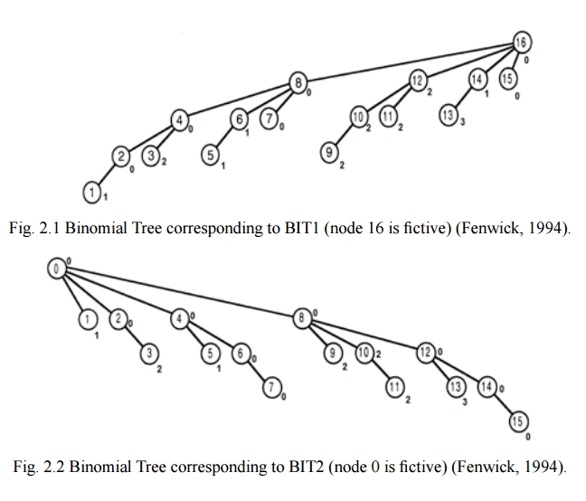

[**LeetCode 1358**](https://leetcode.com/problems/number-of-substrings-containing-all-three-characters/description/). \
Given a string `s` consisting only of characters $a$, $b$ and $c$. \
Return the number of substrings containing **at least** one occurrence of all these characters $a$, $b$ and $c$.

**Решение:** (не эффективно, зато красиво)  (нашёл [здесь](https://leetcode.com/problems/number-of-substrings-containing-all-three-characters/editorial/comments/2891380/))\
Пусть $A$ - подстроки, в которых содержится символ `'a'`. \
Аналогично множества $B$, $C$ - для символов `'b'`, `'c'`, соответственно.

Мы можем находить кол-во подстрок, состоящих **только** из определенных элементов `valid_elem` :
```c++
int f(set<char> valid_elem) {   // count of substrings with restriction
	int ans = 0;
	for(int l = 0; auto e : s)
		if( !valid_elem.count(e) ) l = 0;
		else ans += ++l;

	return ans;
}
```
Например:
1) подсроки состоящие только из элемента `"a"` - это на самом деле будет множество: $\text{}$ $(B \cup C)^\complement$ \
где: $X^\complement$ - дополнение множества $X$

2) подсроки состоящие только из элементов `"a"` или `"b"` - это будет: $\text{}$ $C^\complement$

$\Rightarrow$ $|A \cap B \cap C|$ $=$ $|\varnothing^\complement| - |A^\complement| - |B^\complement| - |C^\complement| + |(A \cup B)^\complement| + |(B \cup C)^\complement| + |(C \cup A)^\complement|$

Т.е.: ``` retrun f("abc") - f("bc") - f("ca") - f("ab") + f("c") + f("a") + f("b") ```

---

$\text{}$
$\text{}$

[**G. Студенческие советы**](https://codeforces.com/edu/course/2/lesson/6/2/practice/contest/283932/problem/G) \
Дано число $k$ - размер студенческого совета, и массив `a[1..n]` — количество студентов в $i$-й группе. \
Каждый студент состоит в какой-то (одной) группе, и студенты из одной группы не могут оказаться в одном совете. \
Также, каждый студент входит максимум в один совет.

Какое максимальное число советов может быть образовано?

**Решение:** бин-поиск по ответу \
Однако, как проверить возможность создания `cnt` советов?

Можно убедится, что следующий код позволяет это сделать:
```c++
bool can(ll cnt) {
    ll acc = 0;
    for(auto e : a)
        acc += min(cnt, (ll)e);
    return acc >= k*cnt;
}
```

---

$\text{}$
$\text{}$


[**146. LRU Cache**](https://leetcode.com/problems/lru-cache/description/) \
todo: \
\+ можно не просто прямой и "обратной" map-ой решить ([submissions](https://leetcode.com/problems/lru-cache/submissions/1576668167/)), \
а можно моделировать время последнего взаимодействия через двусвязный список (см. solution)

 
---

$\text{}$
$\text{}$


[**I. Отрезок с нужным подмножеством**](https://codeforces.com/edu/course/2/lesson/9/3/practice/contest/307094/problem/I) \
Задано число $s$ ($s \le 1000$). Дан массив из $n$ чисел $a_i$ ($n \le 10^5$ , $1 \le a_i \le s$). \
Скажем, что отрезок этого массива $a[l..r]$ хороший, если на этом отрезке можно выбрать некоторый набор чисел, сумма которых равна $s$. \
Ваша задача — найти самый короткий хороший отрезок.


<details>
	
<summary> Решения </summary>


**Решение:** Рассмотрим отрезок $a[l..r]$, давайте узнаем какие суммы можно получить, выбрав некоторые числа в нём. \
Для этого можно воспользоваться DP: пусть $dp[i]$ - кол-во способов выбрать набор чисел (из рассматриваемого отрезка), чтобы сумма чисел набора равнялась $i$.

При добавлении нового элемента $x = a[r+1]$, мы можем в каждый "прошлый" набор чисел (из отрезка $a[l..r]$) как включить, так и невключить $x$. Итого обновляем состояния $dp$:
```cpp
for(int i = s-x; i >= 0; i--)  // добавили x
	dp[i+x] += dp[i];

for(int i = 0; i <= s-x; i++)  // "отменили" добавление x
	dp[i+x] -= dp[i]; 
```
Для полноты покажем, что не важно в каком порядке "создавать" $dp$ - можно добавлять элементы в любом порядке (а не только в порядке $a[l], a[l+1], ..., a[r], a[r+1]$) 


**Итоговый код:**
```cpp
long long unsigned dp[1001] = {1};
for(int l = 0, r = 0; r < n; r++) {
    for(int x = a[r], i = s-x; i >= 0; i--)
	dp[i+x] += dp[i];

    while( dp[s] ) {
	best = min(best, r-l+1);
	for(int y = a[l++], i = 0; i <= s-y; i++)  // <- "удаление"
	    dp[i+y] -= dp[i];                
    }
}
```
Однако это **лажа** и удивительно, что такое решение заходит. Предположим, что в массиве $a$ одни $1$ - тогда состояния $dp$ что-то вроде биномиальных коэффициентов, которые могут принимать значения вплоть до $\text{ } 1000! / 500!^2 \text{ }$ - что явно не влезет в long long unsigned.

**Другие DP:**
 - [comment](https://codeforces.com/edu/course/2/lesson/9/3/practice?#comment-754998): Hey, my approach for Segment with the Required Subset was: I used the two stacks trick that was in the tutorials. Now we only have to recalculate the subset sum when we add an element. We can store the intermediate DP-table of a subset sum as a bitset of size $1001$, where $b[i]$ means that you can reach sum $i$. Then if you add an element to the set, the bitset gets updated like: `b = (b | b<<val)` . Last thing left is to check if current segment is good. We have to merge the top bitset of the first and second stack. This can be done with the bitset and-operation. Only then you have to store one of the bitsets backwards, so the elements line up. The runtime will be $O(n \cdot s / \text{wordsize})$. \
Никак не могу понять?! Как мы "удаляем" самый левый элемент, без полного пересчета отрезка $[l, r]$? \
Так-то, спустя день непрерывного размышления только об этом - разобрался, действительно вообще классное решение, надо будет оформить чтоб не забыть. (и чтобы наконец *возможно* подзабыть об этом, а то прям отпечаталась)

 - [comment](https://codeforces.com/edu/course/2/lesson/9/3/practice?#comment-764700): `dp[j]` is the maximum index of the beginning subsequence whose sum is equal to `j`.
```python
dp = [-1 for i in range(s)]
for i in range(0, n, 1):
    # Update dp array
    for j in range(s, a[i], -1):
        dp[j] = max(dp[j], dp[j-a[i]])
    dp[a[i]] = i
  
    if dp[s] != -1:
	ans = min(ans, i - dp[s] + 1)
```

</details>

---

$\text{}$
$\text{}$

[**784. Эволюция**](https://acmp.ru/asp/do/index.asp?main=task&id_course=2&id_section=21&id_topic=48&id_problem=1009) \
(вообще уже скатился, всё подряд сую) \
Прикол, что для вершины $N$ предком является вершина $(N \text{ >> } 1)$.
```cpp
    llu a, b; cin >> a >> b;
    while( a != b )
        *(llu*[]){&a, &b}[b > a] >>= 1;
	// p.s. можно просто:  (b > a ? b : a) >>= 1;
    cout << a;
```


---

$\text{}$
$\text{}$

#### [652. Find Duplicate Subtrees](https://leetcode.com/problems/find-duplicate-subtrees/description/)
Given the root of a binary tree, return all duplicate subtrees. \
For each kind of duplicate subtrees, you only need to return the root node of any one of them. \
Two trees are duplicate if they have the same structure with the same node values.

<details>
	
<summary> Гениальное кодирование поддеревьев </summary>

(Спасибо [этому решению](https://leetcode.com/problems/find-duplicate-subtrees/solutions/106011/java-concise-postorder-traversal-solution/) )


И как будто можно не только с бинарными деревьями, но и с "обычными": сперва отсортировать детей и потом полиномиальным хешом по ним.

```cpp
// В значении(map.second) хранятся: 
//     <indx этого поддерева, кол-во таких поддеревьев>
map< tuple<int, int, int>, pair<int, int> > all_sub_tree;
vector<TreeNode*> answer;

vector<TreeNode*> findDuplicateSubtrees(TreeNode* root) {
    dfs(root);
    return answer;
}

int dfs(TreeNode* root) { // возвращает indx в all_sub_tree
    if( !root ) return -1;

    auto curr = tuple{root->val, dfs(root->left), dfs(root->right)};

    if( !all_sub_tree.count(curr) ) {
         all_sub_tree[curr] = {all_sub_tree.size(), 0};
    }

    auto& [indx, cnt] = all_sub_tree[curr];
    if( ++cnt == 2 ) answer.push_back(root);
    return indx;
}
```

</details>

---

$\text{}$
$\text{}$

**Чуть про Дейкстру** \
"Рекордная" реализация задачи [1383. Дейкстра за O(M log N)](https://acmp.ru/index.asp?main=bstatus&id_t=1383&lang=CPP)

<details>
	
<summary>305 символов</summary>
	
```cpp
#include<bits/stdc++.h>
using namespace std;

main() {    
    int n, i, j; cin >> n >> j >> j;

    vector d(n, 2009000999);
    set q = { pair{d[j]=0, j} };
             
    map<int, int> e[n];
    while( cin >> i >> j >> n ) e[i][j] = e[j][i] = n;
    
    for(; tie(n, i) = *q.begin(), q.size(); q.erase({n, i}) )
        if( n == d[i] )
            for(auto [J, W] : e[i])
                if( n+W < d[J] )
                    q.emplace( d[J] = n+W, J );
   
    for(int e : d) cout << " " << e;
}
```

</details>

Веса рёбер можно брать не только константными $w_{ij}$, а зависящими от минимальной дистанции от начальной до рассматриваемой вершины: $w_{ij} = w_{ij}( \text{ } d[i] \text{ } )$.

<details>
	
<summary>Задача Автобусы</summary>

> [134. Автобусы.](https://acmp.ru/asp/do/index.asp?main=task&id_course=2&id_section=32&id_topic=54&id_problem=676) Между некоторыми деревнями края Власюки ходят автобусы. \
Маршруты представленны в виде: [деревня отправления] [время отправления] [деревня прибытия] [время прибытия]. \
Марии Ивановне требуется добраться из деревни $A$ в деревню $B$ как можно быстрее (считается, что в момент времени $0$ она находится в деревне $A$).
```cpp
#include<bits/stdc++.h>
using namespace std;

main() {    
    int i, j, n, m, Start, Final, a, b;
    cin >> n >> Start >> Final;
    Start--, Final--;
    vector d(n, 1e9);

    map<int, map<int, int>> e[n];
    cin >> m;
    while( cin >> i >> a >> j >> b ) e[i-1][j-1][a] = b;
    for(int k = 0; auto& e_i : e)
        for(auto& [j, mp] : e_i) {
            int prev = 1e9;
            for(auto p = mp.rbegin(); p != mp.rend(); p++)
                prev = p->second = min(p->second, prev);
        }

    int L_i;  // расстояние до i
    for( set q = { pair{d[Start] = 0, Start} }; tie(L_i, i) = *q.begin(), q.size(); q.erase({L_i, i}) )
        if( L_i == d[i] ) {
            for(const auto& [J, mp] : e[i]) {
                auto p = mp.lower_bound( L_i );
                int W  = p != mp.end() ? p->second : 1e9;
                if( W < d[J] )
                    q.emplace( d[J] = W, J );
            }
        }

    cout << (d[Final] == 1e9 ? -1 : d[Final]);
}
```

</details>

Также можно заметить, что если при каждом успешном обновлении дистанции до вершины класть её в " $set$ ", то алгоритм Дейкстры будет корректно отрабатывать и в графе **с отрицательными ребрами** (главное чтобы не было отрицательных циклов!). Однако сложность может сильно **ухудшиться** - ведь "итоговое" растояние до вершины может по многу раз обновляться, вызывая при этом каскад обновлений её соседей.

<details>
	
<summary>ухудшение как минимум до $O(2^N)$</summary>


</details>


---

$\text{}$
$\text{}$

**Построение дерева Фенвика за $O(N)$** \
Спасибо [этому сайту](https://www.baeldung.com/cs/fenwick-tree) за такое гениальное решение! \
На рисунке показано какую область покрывает каждая вершина - вершина покрывает всё своё поддерево:


```python
algorithm ConstructFenwick(A, n):
    # INPUT   A       = a number array with size n
    # OUTPUT  fenwick = the Fenwick array of A

    fenwick <- A

    for i <- 1 to n:
        parent <- i + (i&-i)  # для случая F(i) = i - (i&-i) + 1
        if parent <= n:
            fenwick[parent] += fenwick[i]

    return fenwick
```
В этом блоге, правда, используется не "стандартное" `F(i) = i&(i+1)`, а `F(i) = i - (i&-i) + 1`, в определении "массива" Фенвика:

$$\text{fenwick}[i] := \sum\limits_{k=F(i)}^i a[k]$$

Оказывается дерево Фенвика можно слегка модифицировать и находить **min** на произвольном отрезке **[L, R]**!
<details>
	
<summary>Подробнее</summary>

Как всегда, спасибо 10+ летним постам в интернете: [источник](https://stackoverflow.com/questions/31106459/how-to-adapt-fenwick-tree-to-answer-range-minimum-queries?lq=1). Плюс там была ссылка на [эту статью](https://ioinformatics.org/journal/v9_2015_39_44.pdf).



**Queries** 
```cpp
Query(int a, int b) {
  int val = infinity // always holds the known min value for our range

  // Start traversing the first tree, BIT1, from the beginning of range, a
  int i = a
  while (parentOf(i, BIT1) <= b) {
    val = min(val, BIT2[i]) // Note: traversing BIT1, yet looking up values in BIT2
    i = parentOf(i, BIT1)
  }

  // Start traversing the second tree, BIT2, from the end of range, b
  i = b
  while (parentOf(i, BIT2) >= a) {
    val = min(val, BIT1[i]) // Note: traversing BIT2, yet looking up values in BIT1
    i = parentOf(i, BIT2)
  }

  val = min(val, REAL[i]) // Explained below
  return val
}
```
It can be mathematically proven that both traversals will end in the same node. That node is a part of our range, yet it is not a part of any subtrees we have looked at. Imagine a case where the (unique) smallest value of our range is in that special node. If we didn't look it up our algorithm would give incorrect results. This is why we have to do that one lookup into the real values array.

**Updates** \
Since a node represents the minimum value of itself and its children, changing a node will affect its parents, but not its children. Therefore, to update a tree we start from the node we are modifying and move up all the way to the fictional root node ($0$ or $N+1$ depending on which tree).

Suppose we are updating some node in some tree:
- `new_value`  $<$  `old_value`, we will always overwrite the value and move up
- `new_value`  $=$  `old_value`, we can stop since there will be no more changes cascading upwards
- `new_value`  $>$  `old_value`, things get interesting:

If the `old_value` still exists somewhere within that subtree, we are done \
If not, we have to find the new minimum value between `real[node]` and each `tree[child_of_node]`, change `tree[node]` and move up \
Pseudocode for updating node with value $v$ in a tree (note that oldValue is the original value we replaced, whereas v may be reassigned multiple times as we move up the tree):
```cpp
while (node <= n+1) {
  if( v < tree[node] ) {
    tree[node] = v
    node = parentOf(node, tree)
    continue
  }

  if( v == tree[node] ) break

  if( oldValue > tree[node] ) break

  v = min(v, real[node])
  for each child {
    v = min(v, tree[child])
  }

  tree[node] = v
  node = parentOf(node, tree)
}
```
Не понятно какая сложность в самом интересном случае? $O(\text{ln}^2 N)$? \
--Вообще не понятно, почему так подробно в том комментарии расписан случай с **Updates**? Почему просто нельзя с элемента подниматься к предку--

</details>

Видимо это что-то подобное [встречному дереву Фенвика](https://neerc.ifmo.ru/wiki/index.php?title=Встречное_дерево_Фенвика). Там, если мы увеличиваем элемент $i$, то чтобы корректно поддерживать min на рассматриваемом интервале $\text{fenwick}[k]$, мы можем выполнить два запроса: `get_min(F(k), i-1)` и `get_min(i+1, k)` - сложность $O(\text{ln}^2 N)$.


---

$\text{}$
$\text{}$


#### [4. Median of Two Sorted Arrays](https://leetcode.com/problems/median-of-two-sorted-arrays/description/)
Требуется найти медиану двух отсортированных массивов.

Первая мысль была: давайте перебирать индексы $(i, j)$ такие что в итоговом массиве элементы $A[i]$ и $B[j]$ идут подряд. \
Для фиксированного $i$ такой $j$ можно найти бинарным поиском за $O(\ln M)$. \
Теперь остается перебирать $i$ ($+$ с учетом крайних случаев, когда $i$ "вышло" за массив $A$) бинарным поиском с целью найти случай когда: $\hspace{3pt}$ $i+j \hspace{2pt} == \hspace{2pt} \frac{n+m}{2}$ . \
Итого: $O(\ln N \ln M)$

Оказывается есть очень элегантное решение (из вкладки solution): \
По сути мы "переворачиваем" прошлое решение. \
Индексу $i$ соответствует $j = \frac{n+m}{2} - i$. \
Давайте перебирать $i$, пока не окажется что элементы $A[i]$ и $B[j]$ идут подряд! (На языке бин-поиска - последний индекс, такой что $A[i] \le B[j]$). \
Итого: $O(\ln N)$

---

Из продолжения такого рода детских задачек. [Этот параграф навеян тем как красиво приведено решение для этой задачки на emaxx] \
Давайте найдем количество всех возможных подмасок всех масок из $N$ элементов (т.е.: $\sum_{mask} \sum_{submask \in mask} 1$ ).

Вполне стандартно находится количество всех множеств - $2^N$. \
Оказывается можно воспользоваться этой идей и здесь. Для каждого элемента есть три возможных варианта: 
- **не**принадлежать маске
- принадлежать маске, но не входить в её подмаску
- входить в подмаску

$\Rightarrow$ Ответ: $3^N$ 

Такой же ответ будет, если мы рассмотрим количество пар не пересекающихся множеств: $(A, B) : A \cap B = \varnothing$.

Давайте проведем между этими объектами биекцию: \
Для каждого множества $A$ рассмотрим $\bar A$ $\Leftrightarrow$ множество $B$ по сути является некоторой подмаской множества $\bar A$. ✓

---

$\text{}$
$\text{}$


Дано корневое дерево. Надо оффлайн отвечать на запросы: $(u, k)$ - количество вершин поддерева $u$, отдаленных от $u$ на растоянии не более чем $k$ рёбер.

<details>
	
<summary>Вроде есть решение за $O(N + Q)$</summary>


(Если что `accum` - это массив который накапливает количество вершин, посещенных на этой глубине в процессе обхода).

Спросил как можно назвать такой метод - Deepseek предложил очень подходящее название Depth-Buckets / Depth-Counting DFS.

```cpp
#include <iostream>
#include <vector>

using namespace std;

vector<vector<int>> edges;

vector<int> answer_query;
// pair: <k, индекс в answer_query>
vector<vector<pair<int, int>>> vertex_query;

vector<int> accum, prfx;
int  dfs_h = 0, max_h;
void dfs(int i, int prev, bool root = 0) {
    accum[dfs_h]++;

    for(auto [k, q] : vertex_query[i])
        answer_query[q] -= prfx[dfs_h] - prfx[min(max_h, dfs_h+k)];

    dfs_h++;
    for(auto j : edges[i])
        if( j != prev )
            dfs(j, i);
    dfs_h--;

    if( !root ) prfx[dfs_h-1] = prfx[dfs_h] + accum[dfs_h];
    
    for(auto [k, q] : vertex_query[i])
        answer_query[q] += prfx[dfs_h] - prfx[min(max_h, dfs_h+k)] + 1;    
}


int main() {
    int n; cin >> n;

    edges.resize(n);
    for(int i = 0; i < n-1; i++) {
        int a, b; cin >> a >> b;
        // a--, b--;
        edges[a].push_back(b);
        edges[b].push_back(a);
    }
    
    vertex_query.resize(n);

    int q; cin >> q;
    answer_query.resize(q);
    for(int i = 0; i < q; i++) {
        int u, k; cin >> u >> k;
        // u--;
        vertex_query[u].push_back( {k, i} );
    }

    max_h = n;
    accum.resize(max_h);
    prfx .resize(max_h+1);
    dfs(0, 0, 1);

    for(int i = 0; i < 4; i++) {
        cout << "For vertex " << i << ":" << endl;
        for(auto [k, q] : vertex_query[i]) {
            cout << k << ": " << answer_query[q] << endl;
        }
        cout << endl;
    }
}
```

</details>


---

$\text{}$
$\text{}$


#### [3534. Path Existence Queries in a Graph II](https://leetcode.com/problems/path-existence-queries-in-a-graph-ii/description/)
По сути задача заключается в следующем: \
Дано $N$ вершин выстроенных в ряд. \
Дан массив $a$ показывающий следующее: вершина $i$ *соединена вправо* (неориентированными рёбрами) с $a[i]$ вершинами. Формально $i$ соединена с вершинами: $\{j : j \in [i, a[i]]\}$, а также (т.к. были рёбра от прыдедущих вершин) с вершинами: $\{j : i \in [j, a[j]]\}$. \
**При этом** область соединения вправо не уменьшается, т.е.: $a[i+1] \ge a[i]-1$.

Требуется отвечать на запросы $(u, v)$ - длинна кратчайшего пути между вершинами $u$ и $v$.

<details>
<summary> O(1) на онлайн запрос / O(N) препроцессинг </summary>

Спасибо этому [solution](https://leetcode.com/problems/path-existence-queries-in-a-graph-ii/solutions/6691653/o-n-q-sort-online-o-1-query-no-binary-lifting-dfs-only/) за такое красивое дерево!

(Везде считается, что в запросе $u \le v$).

**Intuition & Approach** \
First, sort the nums and convert the indices.

Then, using sliding window, we can find the furthest previous node connected with the current node (in one step).

**Key insight:** Reversing these pointers, we can form a tree for each group/section of nodes. **The branch/path from a node to the root is exactly the greedy jump path.**

DFS on each tree, keep tracking the path from each node to the root. For queries ending at the current node, bisearch the starting nodes in the path to get the greedy step counts.

<details>
<summary> 1st Edition Code </summary>

```py3
class Solution:
    def pathExistenceQueries(self, n: int, nums: List[int], maxDiff: int, queries: List[List[int]]) -> List[int]:

        # Sort the nums and convert the indices in queries
        arr = sorted((num, i) for i, num in enumerate(nums))
        mapping = [-1] * n
        for j,(_,i) in enumerate(arr):
            mapping[i] = j
        queries = [sorted((mapping[u], mapping[v])) for u,v in queries]
        nums.sort()
        
        # Find the furthest step to the left for each node
        ptr, prv = 0, []
        for num in nums:
            while num - nums[ptr] > maxDiff:
                ptr += 1
            prv.append(ptr)
        
        # Build the trees with the reversing pointers from the previous step
        conn = [[] for _ in range(n)]
        for i,p in enumerate(prv):
            conn[p].append(i)
        
        # Collect the queries by their ending nodes
        qMap = [[] for _ in range(n)]
        for i,(u,v) in enumerate(queries):
            qMap[v].append((u,i))
            
        # DFS, path maintains the greedy steps from node to root
        def dfs(node: int):
            path.append(node)
            for u,i in qMap[node]:
                if u >= path[0]:
                    # Reachable node u, count the steps from v to u in the path
                    ans[i] = len(path) - bisect_right(path, u)
            for nxt in conn[node]:
                if nxt != node:
                    dfs(nxt)
            path.pop()
            
        ans, path = [-1] * len(queries), []
        for i in range(n):
            if not i or nums[i] - nums[i-1] > maxDiff:
                # Root of a tree, start DFS
                dfs(i)
                
        return ans
```

</details>

$\text{}$

**O(1) на запрос**


При итерировании по массиву вершины дерева по сути встречаются в порядке BFS, и ответ на запрос *(почти) равен* количеству переходов между уровнями на пути от $v$ к $u$. \
**Однако** иногда надо дополнительно добавлять $+1$, в зависимости от расположения поддеревьев - но можно пронумеровать вершины в специальном порядке (как на рисунке), и определять эту ситуацию простым сравнением: `(subtree_enum[node] > subtree_enum[u])`.

Итого ответ на запрос: `level[v] - level[u] + (subtree_enum[v] > subtree_enum[u]`.

<details>
<summary> 2nd Edition Code </summary>

```py3
class Solution:
    def pathExistenceQueries(self, n: int, nums: List[int], maxDiff: int, queries: List[List[int]]) -> List[int]:

        # Sort the nums and convert the indices
        idx = sorted(range(n), key=nums.__getitem__)
        mapping = {j:i for i,j in enumerate(idx)}
        
        # Find the furthest step to the left for each node
        ptr, prv = 0, []
        for j in idx:
            while nums[j] - nums[idx[ptr]] > maxDiff:
                ptr += 1
            prv.append(ptr)
        
        # Build the trees with the reversing pointers from the previous step, and collect the roots
        rts, conn = [], [[] for _ in range(n)]
        for i,p in enumerate(prv):
            if i == p:
                rts.append(i)
            else:
                conn[p].append(i)
            
        # DFS, collect the root, level and post-order number of each node
        def dfs(node: int):
            parent = prv[node]
            root[node] = root[parent]
            level[node] = level[parent] + 1
            order[node] = order[parent]
            for nxt in conn[node]:
                dfs(nxt)
            order[parent] = order[node] + 1
            
        root, level, order = list(range(n)), [0] * n, [0] * n
        for i in rts:
            dfs(i)
                
        # Online, O(1) per query
        ans = []
        for u,v in queries:
            u,v = mapping[u], mapping[v]
            if root[u] != root[v]:
                # Not in the same tree
                ans.append(-1)
            else:
                if u < v:
                    u,v = v,u
                # Get the level difference as their distance
                ans.append(level[u] - level[v] + (order[u] > order[v]))
                
        return ans
```

</details>

</details>

---

$\text{}$
$\text{}$

#### [3403. Find the Lexicographically Largest String From the Box I](https://leetcode.com/problems/find-the-lexicographically-largest-string-from-the-box-i/description)

В строке $s$ найти лексикографически наибольшую подстроку, длинны не более чем $l$. \
На самом деле сводится к поиску лексикографически наибольшого суффикса строки $s$ [[LeetCode1163]](https://leetcode.com/problems/last-substring-in-lexicographical-order/description/). \
(При этом мы не будем накладывать никаких ограничений на размер алфавита).

<details>
<summary> O(N) time, O(1) space </summary>

Действительно, пусть $s[i_{\text{best}}: \text{} ] $ - лексикографически наибольший суффикс, тогда ответом на исходную задачу будет строка, начинающаяся с позиции $i_{\text{best}}$. \
Так как, если для строк: $a \ge b$, то это будет верно и для всех их префиксов: $a[\text{} :l] \ge b[\text{} :l]$.

Теперь найдем наибольший суффикс используя $O(N)$ доп памяти. [[Источник]](https://leetcode.com/problems/last-substring-in-lexicographical-order/solutions/361121/python-o-n-with-explanation/) (на самом деле мы, иттеративно по $l$, будем находить все наибольшие строки длинны $l$) \
Заведем массив претендетов, и будем постепенно увеличивать их длинну (общую для всех). На каждом шаге оставляем только тех, у кого добавилась наибольшая буква. 


Самое интересное происходит, при наложении интервалов. Наверное достаточно естественно (что-то мне не особо), что тогда канидидат $A$ лучше чем $B$ - типо в кандидатах по сути, указатели на наибольшие подстроки длинны $l$ (обозначим такую строку за $X$), значит, какую бы строку $S$ мы бы не приписали к $B$, будет выполнено: $\text{ }  \forall k \text{ }  \hookrightarrow \text{ } \text{prfx}_k(X || S) \le \text{prfx}_k(X||X|| S)$. \
То есть, остается только первый из наложенных кандидатов. И в случае когда накладывается сразу несколько $A$, $B$, $C$, $\dots$ мы анологично оставляем только первого.


Однако при такой реализация "схлопывания" (как на рисунке сверху) мы будем вновь итерироваться по элементам кандидата $B$ и можно показать, что сложность будет больше $O(N)$.

<details>
	
<summary>ухудшение как минимум до $O(N \ln N)$</summary>

Для удобства восприятия будем рассматривать задачу о лексикографически **минимальных** кандидатах.


Строка: `aabaabcaabaabcdaabaabcaabaabcd...` \
Можно выразить реккурсивно:

$$s_0 = \varnothing  \text{ } \text{ , }  \text{ }  s_{i+1} \text{ } = \text{ } s_i \text{ } || \text{ } (`a\text{'} + i) \text{ } ||  \text{ } s_i \text{ } || \text{ } (`a\text{'}  + i) $$

Обозначим: $\text{ }$  $l_i$ - длинна строки $s_i$ , $\text{ }$ $c_i$ - количество действий (красных стрелочек) в строке $s_i$ чтобы остался только один кандидат.

Для $i+1$-го шага, в обеих половинках (длинны $l_i + 1$) будет произведенно одинаковое количество действий:
1. $c_i$ действий чтобы в этой половинке остался один кандидат - это будет строка длинны $l_i / 2 + 1$
2. Эта строка растет до критического состояния (пока не заполнит всю половинку): $\text{ } l_i/2$ действий
3. Каждая половинка смотрит вправо (стрелка с кругом на рисунке) - $1$ действие

Итого:
$$ l_{i+1} = 2 \cdot (l_i + 1) $$
$$ c_{i+1} = 2 \cdot (c_i + 1) + l_i $$

Решая реккуренту получаем: $\text{ }$ $l_n = 2^{n+1}-2$ $\text{ }$ и $\text{ }$ $c_n = n \cdot 2^n$ $\text{ }$  $\Rightarrow$ $\text{ }$  $c_n = O(l_n \ln l_n)$

Можно убедиться, что для этого примера **достаточно было только двух букв**: `a` и `b`. \
Оказывается, строку с схожей структурой уже предлагали в комментариях к решению из [[источника]](https://leetcode.com/problems/last-substring-in-lexicographical-order/solutions/361121/python-o-n-with-explanation/).

</details>

---

$\text{ }$

Давайте рассмотрим следующее **утверждение**: \
Пусть $X$ и $Y$ - последовательно идущие подстроки строки $s$. Их длинны соответственно $n$ и $m$. \
При этом $X$ - является наибольшой подстрокой длинны $n$, аналогично и для $Y$. \
**Тогда:** $\text{ }$ $X \text{ } || \text{ } Y$ - наибольшая подстрока длинны  $n + m$.

<details>

<summary> Покажем от противного </summary>

Пусть есть строка $S$ : $\text{ } S \text{ } > \text{ } X||Y$. \
Рассмотрим позицию их первого различия - $i$.

Если эта позиция соответствует строке $X$, то значит: $\text{ }$ $S[i] > X[i] \text{ } \Rightarrow \text{ } S[\text{}:n] > X$. \
Противоречие, так как $X$ - является наибольшой подстрокой длинны $n$. \
Аналогично, если различие произошло в позиции соответствующей строке $Y$.

</details>

$\text{ }$

Поэтому, мы можем просто  "вливать" все элементы наложенных кандидатов в самого первого. \
В таком решение будет честное $O(N)$ так как каждый элемент рассматривается строго определенное количество раз.


<details>
<summary> Код O(N) space </summary>

```cpp
#define alls(a) a.begin(), a.end()

string lastSubstring(string s) {
    int n = s.size();
    vector<int> candidate(n), new_candidate;
    // изначально в кандидатах пустые строчки  -  т.е. все индексы
    // iota заполняет диапозон последовательно возрастающими значениями, используя оператор ++
    // (см. также std::generate - прикольно)
    iota( alls(candidate), 0 );

    candidate.push_back(-1);  // для упрощения while-а в ~21 строчке
    
    int l = 0;
    while( candidate.size() > 2 ) {
        int max_l    = l;
        int max_char = 0;
        for(int i = 0, cnt_segments; i < candidate.size()-1; i += cnt_segments) {
            int pos  = candidate[i];
            cnt_segments = 1;  // количество подряд идущих наложенных кандидатов
            if( l != 0 )
                while( pos + cnt_segments*l == candidate[i+cnt_segments] )
                    cnt_segments++;

            int cur_l    = cnt_segments*l;
            int cur_char = pos+cur_l < n ? s[pos+cur_l] : 0;
            
            if( cur_l >  max_l || (cur_l == max_l && cur_char >  max_char) ) {
                new_candidate.clear();
                max_l    = cur_l;
                max_char = cur_char;
            }

            if( cur_l == max_l && cur_char == max_char )
                new_candidate.push_back(pos);
        }
        l = max_l + 1;

        swap(candidate, new_candidate);
        new_candidate.clear();
        candidate.push_back(-1);  // для упрощения
    }
    return string( candidate[0] + alls(s) );
}
```

</details>

Эту идею можно доработать и решать за $O(1)$ дополнительной памяти, но что-то кажется и так уже перетрудился с этой задачей.


<details>
<summary> Код O(1) space </summary>

```cpp
string lastSubstring(string s) {
    int n = s.size();
    s.push_back(0);    // Для упрощения while-a в ~8 строчке
    int best = 0;      // start index of the best substring
    int curr = 1;      // start index of the current candidate
    while( curr < n ) {
        int l = 0;     // length of common prefix
        while( best + l < curr && s[best + l] == s[curr + l] )
            l++;

        // наложение кандидатов
        if( best + l == curr ) {
            curr += l;
            continue;
        }
        
        // l - указывет на первый отличающийся символ
        if( s[best + l] > s[curr + l] ) {
            curr += l+1;
        } else {
            // обновляем лучший вариант
            best = curr;
            curr = best + l/2 + 1;
        }
    }
    s.pop_back();
    return s.substr(best);
}

```

</details>


</details>


---

$\text{}$
$\text{}$


<details>
	
<summary>Чуть-чуть про язык</summary>

жесть копался в старом коде ([RubikCubeMoves](RubikCubeMoves/)) и нашёл имбу:
```cpp
// cursed макрос:  RCY([pos][i])  ->  0[pos][i], ...  <->  pos[0][i], ...
#define RCY(a) 0 a, 1 a, 2 a, 3 a 
```
основанную на работе квадратных скобок с указателем: $a[i] \Leftrightarrow  i[a]$

И вот, пришла мысль, почему бы тогда не вызвать:
```cpp
RCY( [a[i]] ) 
    -> 0 [a[i]] , 1 [a[i]] , 2 [a[i]] , 3 [a[i]]
    ->  a[i][0] ,  a[i][1] ,  a[i][2] ,  a[i][3]
```


А можно ещё (и вообще аниме-компьютер вайб будет):
```cpp
#define RCY2(a) 0 [ 0 a,  1 [ 1 a,  2 [ 2 a,  3 [ 3 a 

// хотим a[n][_][m][_]
RCY2( [a[n]][m] ] )
=>   a[n][0][m][0] , a[n][1][m][1] , a[n][2][m][2] , a[n][3][m][3]
```

---

Спасибо интернету, что наткнулся на [C: Stop writing f()](https://nrk.neocities.org/articles/c-stop-writing-old-function-decel). \
Так можно:

```c
#include <stdio.h>

void f1(int x) { printf("f1: %d\n", x); }
void f2(char* s, double t) {
    printf("f2: %s %lf\n", s, t);
}

int main() {
    void (*f) ();

    f = f1;
    f(5);           // -> f1: 5
    
    f = f2;
    f("miku", 0.2); // -> f2: miku 0.2
}
```

</details>


---

$\text{}$
$\text{}$


**Задача**: Досадный сбой (...endian). \
Вы хотите передать $n \le 1000$ беззнаковых $64$-битовых чисел через Интеренет. \
Однако возникла проблема: из-за "сетевых" интерфейсов при передаче порядок байт числа может смениться на противоположный (условно $a_i = b_1 b_2 .. b_7 b_8 \rightarrow b_8 b_7 ... b_2 b_1 $). Каждое $a_i$ либо остается неизменным, либо так меняется. \
Ваша задача - передать исходный массив используя не более $1024$ беззнаковых $64$-битовых чисел и востановить его после возможных искажений.

<details>

<summary> Рабский код </summary>


1. Имея $1$ контрольный бит на число можно детектировать изменение порядка байт на противоположный (см. функцию reap):
    * заведём два указателя - на начало и середину битового представления числа
    * одновременно двигаем указатели пока не встретим различающийся бит (с учетом "endian"-ходьбы по байтам)
    * различающийся бит из первой половины числа - и будет контрольным
    * в итоге при получения числа после возможных искажений, по контрольному биту сможем определить порядок "половин" числа
    * (если различающегося бита не будет - то число в некотором роде палиндром: при смена порядка байт на противоложный число не изменяется)

2. Зарезервировав $2$ бита в числе, мы сможем востановить число после возможных искажений:
    * присвоим: $\text{ }$ $b_1[0] \equiv 0$ $\text{ }$ и $\text{ }$ $b_8[0] \equiv 1$
    * тогда рассмотрев соответствующие позиции полученного числа сможем обнаружить искажения

Таким образом, при передаче можно создавать контрольное число, с зарезервированными $2$-мя битами для "ориентации", и с $62$-мя битами для сохранения контрольных **бит** исходных $a_i$. \
Итого при передаче $n$ (64-битных) чисел потребуется дополнительно $\lceil \frac{n}{62} \rceil$ чисел.

3. Можно рассмотреть следующую конструкцию: (см. InterestingTasks_BadEndian.png)

    * внизу контрольное число с $2$-мя зарезервированными битами и $62$-мя "ребрами" к числам уровнем выше
    * далее от каждого числа вверх идёт по $64$ ребра (т.к. "ориентацию" сохранять не нужно, она определяется по ребру идущему снизу)
    * . . .
    * на самом верху будет $62 \cdot 64^k$ листьев - это и есть исходный передаваемый массив

**Итого** на $n = 62 \cdot 64^k$ чисел потребуется дополнительно: $\text{ } 1 + 62 + 62 \cdot 64 + \dots + 62 \cdot 64^{k-1} \text{ } = \text{ } \frac{n+1}{63} \text{ }$ дополнительных чисел.

Кажется что это предел: если мы передаем $n$ исходных чисел и $l$ дополнительных, то после передачи возможно $2^{n+l}$ возможных исходов (каждое число либо меняется, либо остается неизменным), при этом каждое допольнительные число содержит $64$ бита, что позволяет закодировать $2^{64 \cdot l}$ состояний. \
$\Rightarrow \text{ }  \text{ } 2^{n+l} = 2^{64 \cdot l} \text{ } \text{ } \Rightarrow \text{ } \text{ } l = n/63$

$\text{ }$

Рабский код сделан по 1. и 2. пунктам:

```cpp
#include <bits/stdc++.h>
using namespace std;

#define llu uint64_t

// Первый различающийся бит, с учётом endian-ходьбы по байтам
bool reap(bitset<64> a) {
    for(int blck = 0; blck < 4; blck++) {
        int di = 8*blck, dj = 64 - 8*(blck+1);
        for(int t = 0; t < 8; t++)
            if( a[di + t] != a[dj + t] )
                return a[di+t]; 
    }
    return 0;
}

void code2() {
    int n; cin >> n;
    cout << n + (n+61)/62 << endl;

    bitset<64> chk;
    chk[0] = 0;
    chk[64-8] = 1;

    int l = 1;
    while(n--) {
        llu a; cin >> a;
        cout << a << " ";

        if( l == 64-8 ) l++;
        chk[l++] = reap( bitset<64>(a) );

        if( l == 64 ) {
            l = 1;
            cout << chk.to_ullong() << " ";
        }
    }

    if( l != 1 )
        cout << chk.to_ullong() << " ";
}


// меняем порядок байт на противоположный
llu reorder(llu a) {
    llu r[8];
    const llu m = (((llu)1)<<8) - 1;
    for(int j = 0; j < 8; j++)
        r[j] = (a >> (8*j)) & m;
    
    swap(r[0], r[7]);
    swap(r[1], r[6]);
    swap(r[2], r[5]);
    swap(r[3], r[4]);
    
    llu ans = 0;
    for(int j = 0; j < 8; j++)
        ans |= (r[j] << (j*8));
    return ans;
}

void decode2() {
    int n; cin >> n;
    vector<llu> a(n);
    for(auto&e : a) cin >> e;

    bitset<64> chk;
    int l = 64;
    for(int i = -1; i < n-1; i++) {
        if( l == 64 ) {  // сразу же заходим сюда
            l = 1;
            i++;

            int chk_indx = min(n-1, i+62);
            llu chkk = a[chk_indx];
            chk = chkk&1 ? reorder(chkk) : chkk;
        }

        llu x = a[i];
        
        if( l == 64-8 ) l++;
        if( reap(x) != chk[l++] )
            x = reorder(x);

        cout << x << " ";
    }
}

int main() {
    string s; cin>>s;
    if( s[0] == 'e' ) code2();
    else decode2();
}
```

</details>


---

$\text{}$
$\text{}$

Что идёт дальше, уже и я не читаю... (+ надо бы штуку которая по коммитам создает хронологический порядок)


Иногда полезно рассматривать массив по "Лебегу".

Допустим у нас есть массив `arr[i]` - давайте для каждого значения сохраним индексы, при которых достигается это значение.
```c++
map<ll, vector<int>> heights;
// heights[0] = {-1};  // <- когда как, возможно и не нужно
for(ll prev = 0, i = 0; auto e : arr)
    heights[ prev += e ].push_back(i++);
```
**Примеры использования:** \
[1124. Longest Well-Performing Interval](https://leetcode.com/problems/longest-well-performing-interval/description/) : [submission](https://leetcode.com/problems/longest-well-performing-interval/submissions/1570442269/) \
[862. Shortest Subarray with Sum at Least K](https://leetcode.com/problems/shortest-subarray-with-sum-at-least-k/description/) : [submission](https://leetcode.com/problems/shortest-subarray-with-sum-at-least-k/submissions/1569002067/) \
(не особо, но чем-то схоже: [1590. Make Sum Divisible by P](https://leetcode.com/problems/make-sum-divisible-by-p/description/) : [submission](https://leetcode.com/problems/make-sum-divisible-by-p/submissions/1568969029/))

**Задача.** Дан массив $a_i$. Для каждого $i$ найти кол-во $j < i$, таких что $a_j < a_i$. \
Хочется сразу сделать онлайн решение: будем накапливать значения в `multiset before`, тогда, при получении следующего $a_i$ нужно узнать его (упорядоченную) позицию в multiset-е - это и будет кол-во таких $j$. Оказывается в g++ есть функция order_of_key() - [см.](https://codeforces.com/blog/entry/11080) . \
Можно, также моделировать (упорядоченную) позицию в `before` и через "массив": для каждого j, мы прибавляем по $+1$ на всем интервале $[a_j, MAX a]$. Делать эффективно такие запросы можно например через дерево отрезков.

Однако, хочется решить такую задачу более прозрачнее. Если достаточно оффлайн решения, то можно поступить так: \
$\text{1}$. Отсортируем все значения по уровням \
$\text{2}$. На каждом шаге выгружаем текущий уровень в облако уже рассмотренных точек (в коде `indx`). При этом _находя_ их позиции в этом облаке. 
А как мы эффективно можем находить позиции без техник выше? Видимо как всегда, рассмотрим метод разделяй и влавствуй. . . В итоге получилось подобие merge-sort ( надеюсь тоже с асимптотикой $O(N \text{ ln} N)$ ):

<details>
	
<summary>кринж код</summary>
	
```cpp
vector<int> ans(n, 0);  // ans[i] = размер множества {j : j < i && a[j] < a[i]}

map<int, int> was; // <значение элемента массива, "уровень">
for(auto e : a) was[e];
for(int prev = 0; auto& [k, v] : was) v = prev++;

vector<vector<int>> level(was.size());
for(int i = 0; auto e : a) level[was[e]].push_back(i++);

vector<int> merge(int l, int r) {  // merge-м векторы из отрезка [l, r]
    if( l == r ) return level[l];
    int m = (l+r)/2;

    vector<int> a = merge(l, m), b = merge(m+1, r), result(a.size() + b.size());
    int acc_below = 0;  // <- самая важная переменная!
    for(int i = 0, j = 0, l = 0; l < result.size(); )
        if( j == b.size() || (i < a.size() && a[i] < b[j]) ) {  // выбераем из массива a
            acc_below++;  // - это тоже самое что и переменная i
            result[l++] = a[i++];
        } else {  // выбераем из массива b
            ans[b[j]]  += acc_below;
            result[l++] = b[j++];
        }
    return result;
}

merge(0, was.size()-1);
```

</details>

Ёмае, можно было по адеватному, по длинне длине разделять - [Подсчёт инверсий](https://education.yandex.ru/handbook/algorithms/article/podschet-inversij) (чёт всё подгоняю под _Лебега_).

---

$\text{}$
$\text{}$


Топ сайт, для поиска латехных символов: https://detexify.kirelabs.org/classify.html
