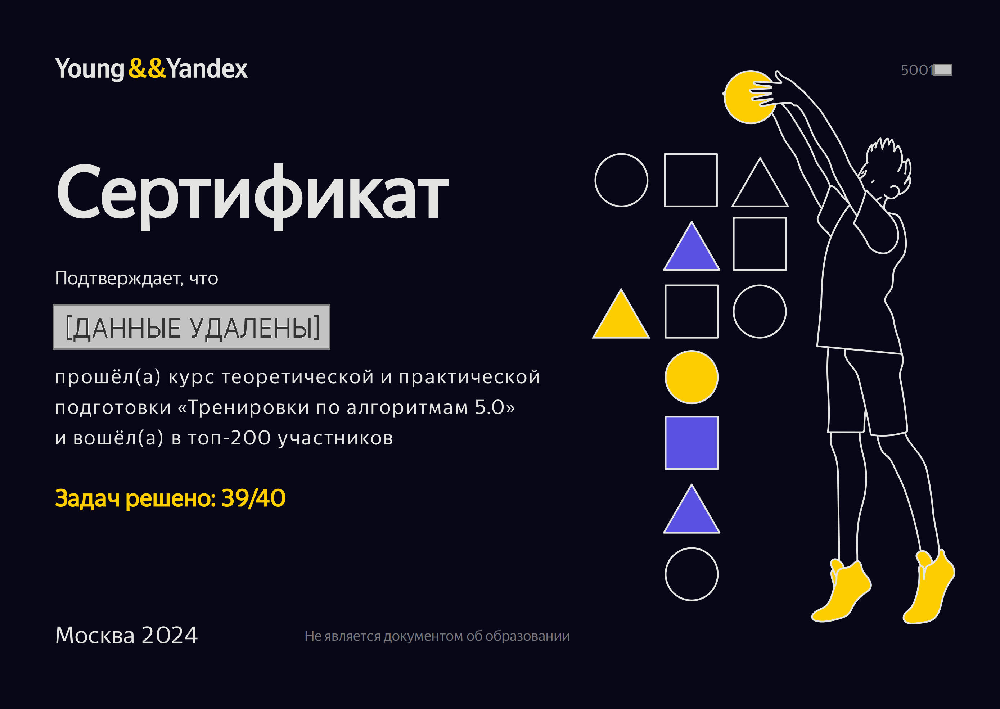

## [Тренировки по алгоритмам 5.0](https://yandex.ru/yaintern/algorithm-training)

Рассматривались темы:
  - Сложность, тестирование, особые случаи
  - Линейный поиск
  - Множества и словари
  - Бинарный поиск

---

Заголовок-ссылка направляет на сайт "тренировок", там в конце страницы есть [таблица](https://yastatic.net/s3/anytask/shmya/Trenirovki_po_algoritmam_5_0.xlsx) (можно убедиться).
