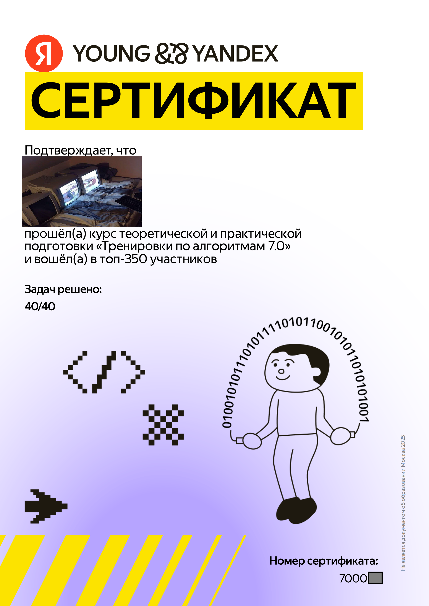

## [Тренировки по алгоритмам 5.0](https://yandex.ru/yaintern/training/algorithm-training_march_2024)

Заголовок-ссылка направляет на сайт "тренировок", там в конце страницы есть [таблица](https://yastatic.net/s3/anytask/shmya/Trenirovki_po_algoritmam_5_0_27_01_2025.xlsx).

## [Тренировки по алгоритмам 6.0](https://yandex.ru/yaintern/training/algorithm-training-october-2024)

[Таблица](https://yandex.ru/yaintern/training/results-algorithm-6) результатов.

## [Тренировки по алгоритмам 7.0](https://yandex.ru/yaintern/algorithm-training)

[Таблица](https://yandex.ru/yaintern/training/results-algorithm-7) результатов.

